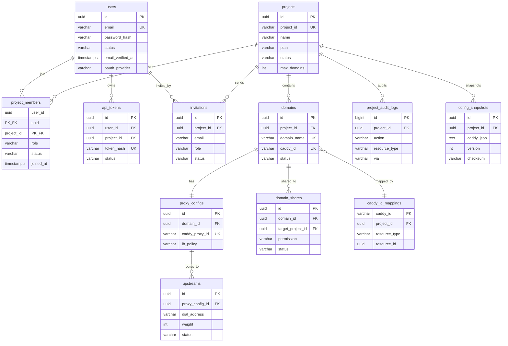

# 基于 Caddy 的分布式权限管理系统 — 系统架构与技术设计文档

> **版本**: v1.3  
> **日期**: 2026-07-24  
> **作者**: 后端架构组  
> **状态**: 设计评审中

---

## 目录

- [1. 核心架构设计](#1-核心架构设计)
  - [1.1 设计理念与 Caddy 官方机制映射](#11-设计理念与-caddy-官方机制映射)
  - [1.2 多租户配置隔离与 @id 标签机制](#12-多租户配置隔离与-id-标签机制)
  - [1.3 细粒度权限控制（RBAC）](#13-细粒度权限控制rbac)
  - [1.4 安全通信：mTLS + JWT 双层认证](#14-安全通信mtls--jwt-双层认证)
  - [1.5 系统整体架构](#15-系统整体架构)
- [2. 用户管理与项目协作模块](#2-用户管理与项目协作模块)
  - [2.1 模块定位](#21-模块定位)
  - [2.2 核心概念模型](#22-核心概念模型)
  - [2.3 用户管理](#23-用户管理)
  - [2.4 项目管理](#24-项目管理)
  - [2.5 项目成员与角色管理](#25-项目成员与角色管理)
  - [2.6 项目共享与资源协作](#26-项目共享与资源协作)
  - [2.7 用户与项目相关的 MCP 工具](#27-用户与项目相关的-mcp-工具)
    - [2.7.4 project_create](#274-tool-project_create)
    - [2.7.5 project_update](#275-tool-project_update)
    - [2.7.6 project_get](#276-tool-project_get)
    - [2.7.7 project_audit_query](#277-tool-project_audit_query)
- [3. 数据模型与状态管理](#3-数据模型与状态管理)
  - [3.1 数据库模型设计](#31-数据库模型设计)
  - [3.2 Caddy JSON 配置映射关系](#32-caddy-json-配置映射关系)
  - [3.3 配置下发与热加载流程](#33-配置下发与热加载流程)
  - [3.4 配置持久化与故障恢复](#34-配置持久化与故障恢复)
- [4. MCP 服务 / Skills 接口设计](#4-mcp-服务--skills-接口设计)
  - [4.1 MCP 工具规范总览](#41-mcp-工具规范总览)
  - [4.2 核心 AI 交互接口定义](#42-核心-ai-交互接口定义)
- [5. 安全与隔离策略](#5-安全与隔离策略)
  - [5.1 越权访问防护](#51-越权访问防护)
  - [5.2 配置下发前的校验机制](#52-配置下发前的校验机制)
  - [5.3 审计与可观测性](#53-审计与可观测性)
- [6. 落地实施路径](#6-落地实施路径)
  - [6.1 里程碑总览](#61-里程碑总览)
  - [6.2 MVP 阶段（第 1–4 周）](#62-mvp-阶段第-14-周)
  - [6.3 完善阶段（第 5–8 周）](#63-完善阶段第-58-周)
  - [6.4 AI 接入阶段（第 9–12 周）](#64-ai-接入阶段第-912-周)
- [附录 A: Caddy Admin API 速查表](#附录-a-caddy-admin-api-速查表)
- [附录 B: 术语表](#附录-b-术语表)

---

## 1. 核心架构设计

### 1.1 设计理念与 Caddy 官方机制映射

Caddy 的设计哲学是**配置即代码（Configuration as Data）**——所有运行时状态都以一棵 JSON 配置树的形式存在于内存中，通过 Admin API（默认 `localhost:2019`）进行全生命周期管理。这棵树支持**零停机热加载**：`POST /load` 可整体替换配置，`POST/PUT/PATCH/DELETE /config/[path]` 可对树的任意节点做细粒度增删改查，且任何变更失败时**自动回滚**到上一个有效配置。

本系统正是基于这一设计哲学，将 Caddy 的 JSON 配置树作为**单一数据面真相源（Single Source of Truth for Data Plane）**，在其上层构建控制面（Control Plane）来管理多租户的配置生命周期。核心映射关系如下：

| Caddy 官方机制 | 本系统用途 | 官方文档依据 |
|---|---|---|
| `@id` 标签字段 | 为每个租户的路由/处理器节点分配全局唯一 ID，实现按名寻址 | [Admin API — @id mechanism](https://caddyserver.com/docs/api#using-the-id-label) |
| `/id/<name>/...` 端点 | 租户通过短路径访问自己的配置节点，无需暴露完整 JSON 路径 | 同上 |
| `Etag` / `If-Match` 头 | 乐观并发控制，防止多租户并发修改冲突 | [Admin API — Concurrent config changes](https://caddyserver.com/docs/api#concurrent-config-changes) |
| `admin.remote` + mTLS | 远程管理端点启用双向 TLS，实现传输层身份认证 | [admin JSON config — remote](https://caddyserver.com/docs/json/admin/remote/) |
| `admin.remote.access_control` | 基于客户端证书的路径+方法级权限控制 | 同上 |
| `POST /load` 零停机重载 | 配置下发后无感热加载，失败自动回滚 | [Admin API — POST /load](https://caddyserver.com/docs/api#post-load) |
| `POST /adapt` | 配置格式适配（如 Caddyfile → JSON），传入 JSON 时仅原样返回，不做语义校验 | [Admin API — POST /adapt](https://caddyserver.com/docs/api#post-adapt) |
| `GET /reverse_proxy/upstreams` | 实时查询上游后端健康状态 | [Admin API — reverse proxy upstreams](https://caddyserver.com/docs/api#get-reverse-proxyupstreams) |

### 1.2 多租户配置隔离与 @id 标签机制

#### 1.2.1 @id 机制原理

Caddy 允许在 JSON 配置的**任意对象**中嵌入 `"@id": "<unique_name>"` 字段。一旦设置，该节点即可通过 `/id/<name>/...` 端点直接访问，而无需指定深层 JSON 路径。例如：

```jsonc
// 完整路径: apps.http.servers.main.routes[0].handle[0]
{
  "@id": "tenant_abc_proxy",
  "handler": "reverse_proxy",
  "upstreams": [{ "dial": "10.0.1.4:8080" }]
}
```

```bash
# 通过 @id 直接访问，无需知道数组索引
curl http://localhost:2019/id/tenant_abc_proxy
```

#### 1.2.2 多租户 @id 命名空间设计

本系统采用**层级化命名空间**为每个租户的配置节点分配 `@id`，确保全局唯一且可追溯：

```
@id 命名规范: tenant_<project_id>_<resource_type>_<resource_id>

约束：
  · `project_id` 字符集: `[a-zA-Z0-9_-]`
  · `@id` 校验正则: `^[a-zA-Z0-9_-]{1,128}$`

示例:
  tenant_abc_route_001        → 路由匹配规则节点
  tenant_abc_proxy_001        → 反向代理处理器节点
  tenant_abc_upstreams_001    → 上游地址池节点
  tenant_abc_header_001       → 请求头操作节点
```

**隔离原理**：

1. **控制面拦截**：所有对 Caddy Admin API 的调用必须经过控制面的 API Gateway，**禁止项目直接访问 Caddy Admin 端点**。
2. **@id 前缀绑定**：控制面在代理项目请求时，强制将路径前缀 `tenant_<project_id>_` 注入所有 `/id/` 操作，确保项目只能操作以自己项目 ID 开头的节点。
3. **配置树分区**：虽然所有租户共享同一 Caddy 实例的 JSON 配置树，但每个租户的路由节点通过 `@id` 命名空间形成逻辑隔离区。

#### 1.2.3 配置树中的租户隔离视图

```
Caddy JSON Config Tree (apps.http.servers.main.routes)
├── [0] { @id: "tenant_abc_route_001", match: [{host: ["api.abc.com"]}], handle: [...] }
├── [1] { @id: "tenant_abc_proxy_001", handler: "reverse_proxy", upstreams: [...] }
├── [2] { @id: "tenant_xyz_route_001", match: [{host: ["app.xyz.com"]}], handle: [...] }
└── [3] { @id: "tenant_xyz_proxy_001", handler: "reverse_proxy", upstreams: [...] }
```

> **关键点**：`@id` 不仅提供了短路径寻址能力，更重要的是为控制面提供了**运行时可审计的归属标记**——任何配置节点都可以通过其 `@id` 前缀追溯到所属租户。

### 1.3 细粒度权限控制（RBAC）

#### 1.3.1 RBAC 模型

系统采用经典的 **主体-角色-权限-资源** 四层模型：

```
用户(User) → 角色(Role) → 权限(Permission) → 资源(Resource)

资源 = @id 标记的 Caddy 配置节点（路由/代理/上游等）
```

#### 1.3.2 角色定义

| 角色 | 权限范围 | 典型操作 |
|---|---|---|
| `owner` | 项目内所有资源 + 项目设置 + 成员管理 + 共享管理 | 创建/修改/删除域名、修改代理、邀请成员、共享域名、项目设置 |
| `admin` | 项目内除删除项目、转移所有权、修改项目设置外的所有操作 | 创建/修改/删除域名、修改代理、邀请成员（不可设为 owner）、共享域名 |
| `editor` | 创建域名、修改代理配置、添加上游；不可删除域名、不可管理成员、不可修改项目设置、不可共享 | 创建域名路由、修改反向代理、添加上游、查询状态 |
| `viewer` | 只读 | 查询配置、查询上游健康状态 |
| `system_admin` | 全局 | 管理所有项目、全局配置、证书 |

#### 1.3.3 权限矩阵

| 资源操作 | owner | admin | editor | viewer |
|---|:---:|:---:|:---:|:---:|
| 创建域名路由 (`POST /id/`) | ✅ | ✅ | ✅ | ❌ |
| 修改反向代理 (`PATCH /id/`) | ✅ | ✅ | ✅ | ❌ |
| 删除配置节点 (`DELETE /id/`) | ✅ | ✅ | ❌ | ❌ |
| 查询配置 (`GET /id/`) | ✅ | ✅ | ✅ | ✅ |
| 查询上游状态 (`GET /reverse_proxy/upstreams`) | ✅ | ✅ | ✅ | ✅ |

> **system_admin 全局权限**：`system_admin` 不纳入项目维度的 RBAC 矩阵，拥有跨项目管理能力，包括管理所有项目、全局 TLS/证书配置、系统级审计与配额等。

#### 1.3.4 权限执行点

权限校验在控制面 API Gateway 的中间件链中执行，分三层：

```
请求入站
  │
  ├─ Layer 1: 身份认证 (JWT 验证 → 提取 project_id + user_id + role)
  │
  ├─ Layer 2: 资源归属校验 (解析目标 @id → 检查 @id 前缀是否匹配 project_id)
  │
  ├─ Layer 3: 操作授权 (根据 role 检查 HTTP method 是否允许)
  │
  └─ 放行至 Caddy Admin API 代理层
```

### 1.4 安全通信：mTLS + JWT 双层认证

Caddy 的 Admin API **默认不提供内置认证机制**（官方文档明确指出安全通过 loopback 绑定、unix socket 或进程隔离实现）。本系统采用 **mTLS（传输层）+ JWT（应用层）双层认证**方案，分别保障控制面到 Caddy 的通信安全和用户到控制面的通信安全。

#### 1.4.1 双层认证架构

```
 ┌──────────┐         JWT (应用层)          ┌──────────────┐      mTLS (传输层)       ┌─────────┐
 │  用户/    │ ←─────────────────────────→ │  控制面       │ ←────────────────────→ │  Caddy  │
 │  AI Agent │   HTTPS + Bearer Token       │  API Gateway │   双向 TLS 证书          │  Admin  │
 └──────────┘                              └──────────────┘                          └─────────┘
```

#### 1.4.2 mTLS 层：控制面 ↔ Caddy

利用 Caddy 的 **`admin.remote`** 配置启用安全远程管理端点（默认端口 `:2021`），强制双向 TLS 认证：

```jsonc
// Caddy 初始配置 — admin 端点 mTLS 配置
{
  "admin": {
    "disabled": false,
    "listen": "localhost:2019",          // 本地明文端点（仅控制面内部使用）
    "remote": {
      "listen": ":2021",                 // 安全远程端点
      "access_control": [
        {
          "public_keys": [
            "<base64-DER: 控制面 API Gateway 的客户端证书公钥>"
          ],
          "permissions": [
            {
              "paths": ["/config/", "/id/", "/load", "/reverse_proxy/"],
              "methods": ["GET", "POST", "PUT", "PATCH", "DELETE"]
            }
          ]
        }
      ]
    },
    "identity": {
      "identifiers": ["caddy.internal"],
      "issuers": [
        { "issuer": "internal" }          // 使用 Caddy 内部 CA 签发服务端证书
      ]
    }
  }
}
```

> **官方机制说明**：`admin.remote.access_control` 支持基于客户端证书公钥的细粒度权限控制——可以为不同的客户端证书分配不同的 `paths`（前缀匹配）和 `methods` 白名单。这是 Caddy 原生提供的应用层权限机制，本系统将其作为**第二道防线**（第一道是控制面 JWT 校验）。

#### 1.4.3 JWT 层：用户/AI Agent ↔ 控制面

```jsonc
// JWT Payload 示例
{
  "sub": "user_abc123",
  "project_id": "abc",
  "role": "admin",
  "scope": ["caddy:route:create", "caddy:proxy:update", "caddy:config:read"],
  "iat": 1721822400,
  "exp": 1721823300,        // 15 分钟有效期
  "jti": "token_unique_id"   // 用于审计与撤销
}
```

**认证流程**：

1. 用户/AI Agent 携带 JWT Bearer Token 发起请求
2. 控制面验证 JWT 签名、有效期、撤销状态
3. 从 JWT 中提取 `project_id`、`role`、`scope`
4. 后续所有资源操作以此身份为上下文

### 1.5 系统整体架构

#### 1.5.1 架构全景

```
╔══════════════════════════════════════════════════════════════════════════════╗
║                          基于 Caddy 的分布式权限管理系统                          ║
╠══════════════════════════════════════════════════════════════════════════════╣
║                                                                              ║
║  ┌──────────────────────────── AI 交互层 ────────────────────────────┐      ║
║  │                                                                  │      ║
║  │   ┌─────────┐    ┌──────────────┐    ┌─────────────────┐         │      ║
║  │   │ 用户     │    │  MCP Server  │    │  Skills         │         │      ║
║  │   │ Web UI  │    │  (JSON-RPC)  │    │  Registry       │         │      ║
║  │   └────┬────┘    └──────┬───────┘    └────────┬────────┘         │      ║
║  │        │                 │                     │                  │      ║
║  │        └─────────────────┼─────────────────────┘                  │      ║
║  │                          │ HTTPS + JWT                            │      ║
║  └──────────────────────────┼────────────────────────────────────────┘      ║
║                             │                                                ║
║  ┌──────────────────────────▼───────── 控制面 ─────────────────────────┐    ║
║  │                                                                     │    ║
║  │  ┌──────────────────────────────────────────────────────────────┐  │    ║
║  │  │                    API Gateway / Auth Middleware               │  │    ║
║  │  │  ┌──────────┐  ┌──────────────┐  ┌───────────┐  ┌─────────┐ │  │    ║
║  │  │  │ JWT 认证  │→ │ RBAC 授权    │→ │ @id 归属  │→ │ 限流    │ │  │    ║
║  │  │  │          │  │              │  │ 校验      │  │         │ │  │    ║
║  │  │  └──────────┘  └──────────────┘  └───────────┘  └─────────┘ │  │    ║
║  │  └──────────────────────────────────────────────────────────────┘  │    ║
║  │                                                                     │    ║
║  │  ┌───────────────┐  ┌───────────────────┐  ┌────────────────────┐  │    ║
║  │  │ 配置翻译引擎   │  │ 校验 & 沙箱预览   │  │ 并发控制           │  │    ║
║  │  │               │  │                   │  │ (Etag/If-Match)    │  │    ║
║  │  │ 业务模型 →    │  │ POST /adapt 预检  │  │                    │  │    ║
║  │  │ Caddy JSON    │  │ + Schema 校验     │  │                    │  │    ║
║  │  └───────┬───────┘  └─────────┬─────────┘  └─────────┬──────────┘  │    ║
║  │          └──────────────────────┴─────────────────────┘             │    ║
║  │                                  │                                  │    ║
║  └──────────────────────────────────┼──────────────────────────────────┘    ║
║                                     │ mTLS (双向 TLS, :2021)               ║
║  ┌──────────────────────────────────▼──── 数据面 ──────────────────────┐    ║
║  │                                                                     │    ║
║  │   ┌─────────────────────────────────────────────────────────────┐   │    ║
║  │   │                    Caddy Server Instance                      │   │    ║
║  │   │                                                                │   │    ║
║  │   │   ┌─────────────────────────────────────────────────────┐    │   │    ║
║  │   │   │              JSON Config Tree (内存)                  │    │   │    ║
║  │   │   │                                                        │    │   │    ║
║  │   │   │  apps.http.servers.main.routes[]                       │    │   │    ║
║  │   │   │    ├── @id: tenant_abc_route_001  (host: api.abc.com)  │    │   │    ║
║  │   │   │    ├── @id: tenant_abc_proxy_001  (→ 10.0.1.4:8080)   │    │   │    ║
║  │   │   │    ├── @id: tenant_xyz_route_001  (host: app.xyz.com)  │    │   │    ║
║  │   │   │    └── @id: tenant_xyz_proxy_001  (→ 10.0.2.5:3000)   │    │   │    ║
║  │   │   └─────────────────────────────────────────────────────┘    │   │    ║
║  │   │                                                                │   │    ║
║  │   │   Admin API (:2019 本地 / :2021 mTLS)                        │   │    ║
║  │   │   零停机热加载 + 失败自动回滚                                   │   │    ║
║  │   └─────────────────────────────────────────────────────────────┘   │    ║
║  │                                                                     │    ║
║  └─────────────────────────────────────────────────────────────────────┘    ║
║                                     │                                       ║
║  ┌──────────────────────────────────▼──────────────────────────────────┐   ║
║  │                         存储层                                       │   ║
║  │  ┌──────────┐  ┌──────────────┐  ┌───────────┐  ┌──────────────┐  │   ║
║  │  │ 用户/    │  │ 工作区/租户  │  │ 域名资源  │  │ @id ↔ 资源   │  │   ║
║  │  │ 角色表   │  │ 元数据表     │  │ 映射表    │  │ 映射表       │  │   ║
║  │  └──────────┘  └──────────────┘  └───────────┘  └──────────────┘  │   ║
║  └─────────────────────────────────────────────────────────────────────┘   ║
╚══════════════════════════════════════════════════════════════════════════════╝
```

#### 1.5.2 三层架构职责划分

| 层次 | 职责 | 核心组件 |
|---|---|---|
| **AI 交互层** | 将自然语言/指令转化为标准 API 调用；对外暴露 MCP Tools 和 Skills | MCP Server（JSON-RPC 2.0）、Skills Registry、LLM Tool Router |
| **控制面** | 认证授权、配置翻译、校验、并发控制、租户隔离、审计 | API Gateway、Auth Middleware、Config Translation Engine、Validation Sandbox |
| **数据面** | 执行配置热加载、路由匹配、反向代理、TLS 自动化 | Caddy Server Instance（Admin API + JSON Config Tree） |
| **存储层** | 持久化业务数据与配置映射关系 | PostgreSQL（业务数据）、Redis（缓存/会话）、MinIO（证书存储） |

#### 1.5.3 请求流转全链路

```
用户/AI Agent 发起请求: "为 api.abc.com 创建反向代理到 10.0.1.4:8080"

  │ ① AI 交互层: MCP Tool "create_reverse_proxy" 被调用
  │    → 参数: { domain: "api.abc.com", upstream: "10.0.1.4:8080" }
  │
  ▼
  │ ② 控制面: API Gateway 收到 HTTPS + JWT 请求
  │    → JWT 校验: 提取 project_id=abc, role=admin
  │    → RBAC 校验: admin 有 caddy:proxy:create 权限 ✅
  │    → @id 归属校验: 检查 tenant_abc 是否拥有 api.abc.com ✅
  │
  ▼
  │ ③ 控制面: 配置翻译引擎
  │    → 生成 @id: tenant_abc_proxy_001
  │    → 翻译为 Caddy JSON 片段:
  │      { "@id":"tenant_abc_proxy_001", "handler":"reverse_proxy",
  │        "upstreams":[{"dial":"10.0.1.4:8080"}] }
  │    → 生成路由: { "@id":"tenant_abc_route_001",
  │      "match":[{"host":["api.abc.com"]}], "handle":[{...}] }
  │
  ▼
  │ ④ 控制面: 校验 & 沙箱预览
  │    → JSON Schema 校验 ✅
  │    → POST /adapt 预检（不加载）✅
  │    → 业务规则校验（域名归属、端口限制等）✅
  │
  ▼
  │ ⑤ 控制面: 并发控制
  │    → GET /config/... 获取当前 Etag
  │    → 准备 If-Match 头
  │
  ▼
  │ ⑥ 数据面: 下发到 Caddy (via mTLS :2021)
  │    → POST /config/apps/http/servers/main/routes
  │       Content-Type: application/json
  │       If-Match: <etag>
  │       Body: { "match": [...], "handle": [...] }
  │    → Caddy 零停机热加载
  │    → 若失败 → 自动回滚
  │
  ▼
  │ ⑦ 存储层: 更新数据库映射
  │    → 记录 @id ↔ 域名 ↔ 租户 的映射关系
  │    → 记录审计日志
  │
  ▼
  返回结果: { "status": "success", "route_id": "tenant_abc_route_001",
              "proxy_id": "tenant_abc_proxy_001" }
```

---

## 2. 用户管理与项目协作模块

> 本模块解决多租户系统中的**身份管理、项目划分、资源共享与成员协作**问题。
> 设计目标：一个用户可以拥有多个项目（工作区），一个项目可以邀请多个成员，成员可以拥有不同角色，项目之间可以共享域名资源。

### 2.1 模块定位

原方案中的"工作区（Workspace）"概念在本模块中被**细化升级为"项目（Project）"**，并引入用户中心、项目成员、共享机制三个子系统：

```
┌─────────────────────────────────────────────────────────────┐
│                    用户管理与项目协作模块                       │
│                                                             │
│  ┌──────────────┐  ┌──────────────┐  ┌──────────────────┐ │
│  │  用户中心     │  │  项目管理     │  │  共享与成员管理   │ │
│  │              │  │              │  │                  │ │
│  │ · 注册/登录   │  │ · 创建项目   │  │ · 邀请成员       │ │
│  │ · 个人信息   │  │ · 项目配置   │  │ · 角色分配       │ │
│  │ · API Token  │  │ · 项目配额   │  │ · 资源共享       │ │
│  │ · 多项目切换 │  │ · 项目设置   │  │ · 权限继承       │ │
│  └──────────────┘  └──────────────┘  └──────────────────┘ │
│                                                             │
│  与第 1 章 RBAC 的关系：本模块管理"谁在哪个项目中是什么角色"  │
│  RBAC 引擎消费本模块产出的 (user, project, role) 三元组      │
└─────────────────────────────────────────────────────────────┘
```

### 2.2 核心概念模型

```
用户 (User)
  │
  │ 1:N
  ▼
项目 (Project / Workspace)  ←─── 租户隔离边界
  │
  │ 1:N
  ▼
项目成员 (ProjectMember)  ←─── 用户与项目的 N:N 关系
  │
  │ 携带角色: owner / admin / editor / viewer
  │
  │ 1:N
  ▼
域名资源 (Domain)  ←─── 属于某个项目
  │
  │ 可被共享给其他项目
  ▼
共享记录 (DomainShare)  ←─── 跨项目资源共享
```

#### 概念说明

| 概念 | 说明 | 与 Caddy 的关系 |
|---|---|---|
| **用户 (User)** | 系统的最终使用者，拥有独立身份凭证 | 一个用户可关联多个项目 |
| **项目 (Project)** | 原"工作区"的升级版，是资源隔离的基本单元 | 每个项目对应一组 Caddy `@id` 前缀 `tenant_<project_id>_` |
| **项目成员 (ProjectMember)** | 用户与项目的关联，携带角色信息 | 决定用户对该项目下 Caddy 资源的操作权限 |
| **项目角色** | owner（所有者）/ admin / editor / viewer | 映射到第 1 章 RBAC 的角色定义 |
| **资源共享 (DomainShare)** | 将一个项目的域名配置共享给另一个项目 | 被共享方获得只读或编辑权限，但 `@id` 归属不变 |

### 2.3 用户管理

#### 2.3.1 用户生命周期

```
         注册请求
            │
            ▼
     ┌─────────────┐
     │  待激活      │  ← 邮件验证码/OAuth 回调
     └──────┬──────┘
            │ 激活
            ▼
     ┌─────────────┐
     │  活跃        │  ← 正常使用
     └──────┬──────┘
            │ 管理员操作 / 安全事件
            ▼
     ┌─────────────┐         申诉通过
     │  冻结        │ ──────────────→ 回到 活跃
     └──────┬──────┘
            │ 30 天保留期
            ▼
     ┌─────────────┐
     │  已删除       │  ← 数据匿名化，Caddy 配置清理
     └─────────────┘
```

#### 2.3.2 用户认证方式

| 认证方式 | 适用场景 | 说明 |
|---|---|---|
| **邮箱 + 密码** | 标准 Web 注册 | Argon2id 哈希存储，支持 2FA TOTP |
| **OAuth 2.0** | 第三方登录 | GitHub / Google / 企业 SSO |
| **API Token** | CLI / CI/CD / AI Agent | 长期令牌，绑定到特定项目，可设置过期与 scope |
| **MCP 会话令牌** | AI 助手交互 | 短期令牌，从 API Token 派生，携带 project_id 上下文 |

#### 2.3.3 API Token 管理

```jsonc
// API Token 数据结构
{
  "token_id": "tok_abc123",
  "user_id": "user_001",
  "project_id": "proj_abc",         // 绑定到特定项目
  "name": "CI/CD Deploy Token",
  "scopes": [                        // 该 Token 的权限范围
    "caddy:domain:create",
    "caddy:proxy:update",
    "caddy:config:read"
  ],
  "expires_at": "2026-12-31T23:59:59Z",
  "last_used_at": "2026-07-24T13:39:01Z",
  "ip_whitelist": ["203.0.113.0/24"],  // 可选 IP 白名单
  "status": "active"
}
```

> **安全设计**：API Token 仅在创建时返回完整明文一次，数据库存储 SHA-256 哈希。Token 前缀（如 `tok_abc1****`）用于日志脱敏展示。

### 2.4 项目管理

#### 2.4.1 项目与原"工作区"的关系

| 原方案概念 | 升级后概念 | 变化说明 |
|---|---|---|
| Workspace | **Project** | 重命名，语义更清晰 |
| `tenant_id`（旧称） | **project_id** | 作为 `@id` 前缀：`tenant_<project_id>_` |
| 单一所有者 | **owner + 多成员** | 支持团队协作 |
| 无共享机制 | **DomainShare** | 支持跨项目资源共享 |
| 无元数据 | **丰富元数据** | 仓库地址、端口、描述、环境标签等 |

#### 2.4.2 项目元数据模型

项目不仅是 Caddy 配置的隔离容器，还承载完整的业务上下文信息：

```jsonc
// 项目完整数据结构
{
  "id": "proj_abc123",
  "name": "电商平台 API 网关",
  "description": "面向电商核心服务的 API 网关项目，包含订单、支付、库存等微服务的反向代理配置",

  // ── 业务元数据 ──
  "repository": {
    "url": "https://github.com/myteam/ecommerce-gateway",
    "branch": "main",
    "auto_sync": false                  // 是否从仓库自动同步配置（未来扩展）
  },
  "ports": {
    "exposed": [80, 443],               // 对外暴露端口
    "internal": [8080, 8081, 8082]      // 内部服务端口白名单（限制上游可配置的端口范围）
  },
  "environment": "production",          // development / staging / production
  "tags": ["e-commerce", "api-gateway", "high-traffic"],

  // ── 配额与限制 ──
  "plan": "pro",
  "limits": {
    "max_domains": 50,
    "max_upstreams_per_proxy": 10,
    "max_members": 20,
    "max_shared_domains": 10,
    "max_config_snapshots": 100,
    "rate_limit": {
      "requests_per_minute": 60,
      "writes_per_minute": 20
    }
  },

  // ── 关联配置 ──
  "caddy_server_id": "caddy-node-01",   // 所属 Caddy 实例（多节点部署时区分）
  "default_ssl_mode": "auto",           // auto / manual / disabled

  // ── 状态 ──
  "status": "active",                   // active / suspended / deleting / deleted
  "created_by": "user_001",
  "created_at": "2026-07-01T10:00:00Z",
  "updated_at": "2026-07-24T13:39:01Z"
}
```

#### 2.4.3 元数据字段说明

| 字段 | 类型 | 必填 | 说明 | 与 Caddy 的关系 |
|---|---|:---:|---|---|
| `name` | string | 是 | 项目显示名称 | — |
| `description` | string | 否 | 项目描述，支持 Markdown | — |
| `repository.url` | string | 否 | Git 仓库地址，用于关联代码库 | 未来可从仓库自动同步 Caddyfile |
| `repository.branch` | string | 否 | 默认分支 | 自动同步时使用 |
| `ports.exposed` | int[] | 否 | 对外暴露端口 | 影响 Caddy `listen` 配置范围 |
| `ports.internal` | int[] | 否 | 内部服务端口白名单 | **限制上游 `dial` 地址可用的端口范围**，防止配置非法端口 |
| `environment` | enum | 否 | 环境标识 | 可用于区分不同 Caddy 实例或配置策略 |
| `tags` | string[] | 否 | 业务标签 | 用于分类检索 |
| `caddy_server_id` | string | 否 | 所属 Caddy 节点 | 多节点部署时路由到正确的 Caddy 实例 |
| `default_ssl_mode` | enum | 否 | 默认 TLS 模式 | 新建域名时的默认 SSL 策略 |

> **安全设计**：`ports.internal` 是一个重要的安全约束字段。控制面在翻译 Caddy JSON 时，会校验上游 `dial` 地址的端口是否在项目的端口白名单内。例如项目配置 `internal: [8080, 8081]`，用户尝试添加上游 `10.0.1.4:3306`（数据库端口）将被拒绝。

#### 2.4.4 项目配额与限制

```jsonc
// 项目配额配置（按 plan 等级区分）
{
  "plan": "pro",
  "limits": {
    "max_domains": 50,                    // 最大域名数
    "max_upstreams_per_proxy": 10,        // 每个代理最大上游数
    "max_members": 20,                    // 最大成员数
    "max_shared_domains": 10,             // 最大可共享出的域名数
    "max_config_snapshots": 100,         // 配置快照保留数
    "rate_limit": {                       // API 速率限制
      "requests_per_minute": 60,
      "writes_per_minute": 20
    }
  }
}
```

#### 2.4.5 项目管理 REST API

```yaml
# 项目 CRUD
POST   /api/v1/projects                      # 创建项目（含元数据）
GET    /api/v1/projects                      # 列出我的项目（支持按 tag/environment 过滤）
GET    /api/v1/projects/{id}                 # 获取项目详情（含完整元数据）
PATCH  /api/v1/projects/{id}                 # 更新项目元数据（名称、描述、仓库、端口、标签等）
DELETE /api/v1/projects/{id}                 # 删除项目（级联清理 Caddy 配置）

# 项目成员管理
GET    /api/v1/projects/{id}/members         # 列出成员
POST   /api/v1/projects/{id}/members         # 邀请成员
PATCH  /api/v1/projects/{id}/members/{uid}   # 修改成员角色
DELETE /api/v1/projects/{id}/members/{uid}   # 移除成员

# 项目共享
POST   /api/v1/projects/{id}/domains/{did}/shares  # 共享域名给其他项目
GET    /api/v1/projects/{id}/domains/{did}/shares  # 查看共享记录
DELETE /api/v1/shares/{sid}                        # 撤销共享

# 项目审计
GET    /api/v1/projects/{id}/audit-logs            # 查询项目审计日志
GET    /api/v1/projects/{id}/audit-logs?actor=user&action=update  # 按操作者/动作过滤
GET    /api/v1/projects/{id}/audit-logs?resource_type=domain      # 按资源类型过滤
GET    /api/v1/projects/{id}/audit-logs?from=2026-07-01&to=2026-07-31  # 按时间范围
```

#### 2.4.6 项目创建与更新流程

```
用户/AI 发起项目创建/更新请求
            │
            ▼
   ┌──────────────────┐
   │  身份认证 + 授权  │  JWT → 确认有 project:create / project:update 权限
   └────────┬─────────┘
            ▼
   ┌──────────────────┐
   │  元数据校验       │  · 仓库 URL 格式校验
   │                  │  · 端口白名单合法性（不与系统保留端口冲突）
   │                  │  · 环境标识枚举校验
   │                  │  · 标签数量与长度限制
   └────────┬─────────┘
            ▼
   ┌──────────────────┐
   │  配额校验（仅创建）│  · 用户已有项目数是否超限
   └────────┬─────────┘
            ▼
   ┌──────────────────┐
   │  写入数据库       │  · projects 表 + project_members 表（owner）
   │                  │  · 更新时间戳
   └────────┬─────────┘
            ▼
   ┌──────────────────┐
   │  审计记录         │  · 写入 project_audit_logs
   │                  │  · 记录操作前后对比（diff）
   └────────┬─────────┘
            ▼
   ┌──────────────────┐
   │  生成 Caddy 配置  │  · 分配 @id 前缀 tenant_<project_id>_
   │  初始化上下文     │  · 在 Caddy 中创建项目级路由占位（仅创建时）
   │  （仅创建时）     │  · 配置 admin.config.persist 确保持久化
   └──────────────────┘
```

#### 2.4.7 项目审计记录

项目维度的审计日志独立于 Caddy 配置审计（第 5.3 节），关注的是**项目自身的元数据变更与生命周期事件**：

```jsonc
// 项目审计日志条目
{
  "id": "audit_001",
  "project_id": "proj_abc123",
  "actor": {
    "type": "user",                    // user / ai_agent / system
    "id": "user_001",                  // 操作者 ID
    "name": "张三",                    // 操作者名称
    "ip": "203.0.113.50"               // 操作来源 IP
  },
  "action": "project.update",         // project.create / project.update / project.delete
                                        // member.invite / member.remove / member.role_change
                                        // domain.create / domain.update / domain.delete
                                        // share.create / share.revoke
  "resource_type": "project",          // project / member / domain / share / config
  "resource_id": "proj_abc123",
  "changes": {                         // 变更详情（仅 update 操作）
    "before": {
      "description": "旧描述",
      "ports": { "internal": [8080] }
    },
    "after": {
      "description": "新描述",
      "ports": { "internal": [8080, 8081] }
    }
  },
  "result": "success",                // success / failed
  "error_message": null,              // 失败时的错误信息
  "metadata": {                       // 额外上下文
    "via": "mcp_tool",                // web_ui / mcp_tool / api_token / system
    "mcp_tool_name": "project_update", // 如果通过 AI 调用
    "user_agent": "Claude/3.5"
  },
  "created_at": "2026-07-24T13:39:01Z"
}
```

**审计事件类型总览**：

| 事件类型 | 触发场景 | 审计内容 |
|---|---|---|
| `project.create` | 创建项目 | 项目元数据、创建者 |
| `project.update` | 更新项目元数据 | 变更前后对比 diff |
| `project.delete` | 删除项目 | 删除原因、级联清理的 Caddy 配置列表 |
| `member.invite` | 邀请成员 | 被邀请人邮箱、分配角色 |
| `member.join` | 成员接受邀请 | 成员信息、角色 |
| `member.remove` | 移除成员 | 被移除成员、操作者 |
| `member.role_change` | 修改成员角色 | 前后角色对比 |
| `domain.create` | 创建域名 | 域名、上游地址 |
| `domain.update` | 修改域名配置 | 变更 diff |
| `domain.delete` | 删除域名 | 被删除的域名及关联 @id |
| `share.create` | 共享域名 | 共享目标项目、权限 |
| `share.revoke` | 撤销共享 | 被撤销的共享记录 |
| `config.rollback` | 配置回滚 | 回滚前后版本号 |

#### 2.4.8 项目状态机

```
                创建项目
                   │
                   ▼
             ┌───────────┐
             │  active    │ ←───── 解冻（申诉通过）
             └─────┬─────┘
                   │ 管理员操作 / 配额超限 / 安全事件
                   ▼
             ┌───────────┐
             │ suspended  │
             └─────┬─────┘     ┌──────────────────────────┐
                   │           │  suspended 状态下:        │
                   │ 删除请求   │  · Caddy 配置保持运行     │
                   ▼           │  · 但 API 写操作被拒绝    │
             ┌───────────┐     │  · 只读操作仍允许         │
             │ deleting   │     └──────────────────────────┘
             └─────┬─────┘
                   │ 级联清理完成:
                   │ · 删除 Caddy @id 节点
                   │ · 清理数据库映射
                   │ · 归档审计日志
                   ▼
             ┌───────────┐
             │  deleted   │  ← 30 天保留期后物理删除
             └───────────┘
```

### 2.5 项目成员与角色管理

#### 2.5.1 成员角色体系

在原 RBAC 基础上，为项目维度增加更细粒度的角色：

| 项目角色 | 域名管理 | 代理配置 | 成员管理 | 项目设置 | 共享管理 |
|---|:---:|:---:|:---:|:---:|:---:|
| **owner** | 全部 | 全部 | 全部 | 全部 | 可操作 |
| **admin** | 全部 | 全部 | 除 owner | 不可操作 | 可操作 |
| **editor** | 增改查 | 增改查 | 不可操作 | 不可操作 | 不可操作 |
| **viewer** | 只读 | 只读 | 不可操作 | 不可操作 | 不可操作 |

#### 2.5.2 成员邀请流程

```
项目 admin 发起邀请
       │
       ▼
┌──────────────┐
│ 生成邀请链接  │  ← 包含 project_id + 邀请角色 + 过期时间(24h)
│ + 邀请码     │     签名为 JWT，防止篡改
└──────┬───────┘
       │
       ▼
┌──────────────┐
│ 邮件通知     │  → 被邀请人收到邀请链接
└──────┬───────┘
       │
       ▼
┌──────────────┐         拒绝
│ 被邀请人查看  │ ──────────→ 邀请失效
│ 邀请详情     │
└──────┬───────┘
       │ 接受
       ▼
┌──────────────┐
│ 加入项目     │  → 写入 project_members 表
│ + 分配角色   │  → 返回 JWT（含 project_id + role）
└──────────────┘
```

#### 2.5.3 权限继承与隔离

```go
// 伪代码：项目成员的权限解析
type ProjectPermissionResolver struct {
    db    *repository.Queries
    roles map[string]PermissionScope // 角色权限映射表
}

func (r *ProjectPermissionResolver) Resolve(ctx context.Context, userID, projectID string) (*Permission, error) {
    // 1. 查询成员关系
    member, err := r.db.GetProjectMember(ctx, userID, projectID)
    if err != nil {
        // 2. 检查是否有通过共享获得的权限
        shares, err := r.db.GetDomainSharesByTarget(ctx, projectID)
        if err != nil {
            return nil, ErrForbidden // 不是项目成员
        }
        if len(shares) > 0 {
            return &Permission{Role: "shared_viewer", Scope: shares[0].Scope}, nil
        }
        return nil, ErrForbidden
    }

    // 3. 返回项目内角色对应的权限
    return &Permission{
        Role:      member.Role, // owner / admin / editor / viewer
        ProjectID: projectID,
        Scope:     r.roles[member.Role],
    }, nil
}
```

### 2.6 项目共享与资源协作

#### 2.6.1 共享模型

```
项目 A (owner: api.abc.com)
  │
  │  共享域名配置
  │  权限: read_only / edit
  │
  ▼
共享记录 (DomainShare)
  │
  │  被共享给
  ▼
项目 B (viewer: 可查询 A 的代理状态)
  │
  │  但 @id 归属不变: 仍为 tenant_A_route_001
  │  项目 B 不能删除/修改共享来的配置（read_only 模式）
  │  edit 模式下可修改上游地址，但不能删除域名本身
  ▼
```

#### 2.6.2 共享权限矩阵

| 共享权限 | 查看配置 | 查询健康状态 | 修改上游 | 修改代理 | 删除域名 |
|---|:---:|:---:|:---:|:---:|:---:|
| **read_only** | 可 | 可 | 不可 | 不可 | 不可 |
| **edit** | 可 | 可 | 可 | 可 | 不可（仅 owner 可删） |

#### 2.6.3 共享的安全约束

```go
// 伪代码：共享操作的安全校验
type ShareValidator struct {
    db *repository.Queries
}

func (v *ShareValidator) ValidateShare(ctx context.Context, domainID, targetProjectID, permission string) (*ValidationResult, error) {
    var errs []string

    // 1. 不能共享给自己
    domain, err := v.db.GetDomain(ctx, domainID)
    if err != nil {
        return nil, err
    }
    if domain.ProjectID == targetProjectID {
        errs = append(errs, "Cannot share a domain to its own project")
    }

    // 2. 循环共享检测：基于图遍历
    // 将共享关系建模为有向图，顶点是项目，边是 domain_share(source_project_id → target_project_id)。
    // 以 domain.ProjectID 为起点沿出边正向遍历（或以 targetProjectID 为起点沿入边反向遍历），
    // 若可达 targetProjectID（或反向可达 domain.ProjectID），则说明本次共享会形成闭环，应拒绝。
    if v.shareGraph.HasPath(domain.ProjectID, targetProjectID) {
        errs = append(errs, "Circular sharing detected")
    }

    // 3. 共享配额检查：检查源项目 MaxSharedDomains 配额
    shareCount, _ := v.db.CountSharesBySource(ctx, domain.ProjectID)
    sourceProject, _ := v.db.GetProject(ctx, domain.ProjectID)
    if shareCount >= sourceProject.MaxSharedDomains {
        errs = append(errs, "Shared domain quota exceeded")
    }

    // 4. @id 归属标记不变
    // 共享不改变 caddy_id 前缀，被共享方通过映射表间接访问
    // 控制面在校验时会检查共享关系而非直接检查 @id 前缀

    return &ValidationResult{Valid: len(errs) == 0, Errors: errs}, nil
}
```

#### 2.6.4 共享场景的 @id 访问控制

共享机制引入了一个新的安全挑战：被共享方需要访问**不属于自己项目的 @id 节点**。控制面需要扩展第 1 章的 @id 归属校验逻辑：

```go
// 伪代码：扩展后的 @id 归属校验（支持共享）
type CaddyIDOwnershipMiddleware struct {
    db *repository.Queries
}

func (m *CaddyIDOwnershipMiddleware) CheckOwnership(ctx context.Context, projectID, caddyID, httpMethod string) error {
    // 1. 直接归属检查（原有逻辑）
    mapping, err := m.db.GetMapping(ctx, caddyID, projectID)
    if err == nil && mapping != nil {
        return nil // 直接拥有
    }

    // 2. 共享归属检查（新增逻辑）
    share, err := m.db.GetShareByCaddyID(ctx, caddyID, projectID)
    if err == nil && share != nil && share.Status == "active" {
        // 检查共享权限是否允许当前操作
        switch {
        case share.Permission == "read_only" && httpMethod == "GET":
            return nil
        case share.Permission == "edit" && httpMethod != "DELETE":
            return nil // edit 模式不允许 DELETE
        default:
            return fmt.Errorf("shared resource access denied: %s does not allow %s",
                share.Permission, httpMethod)
        }
    }

    // 3. 既不直接拥有也未共享 → 越权
    return ErrForbidden
}
```

### 2.7 用户与项目相关的 MCP 工具

补充 3 个与用户/项目管理相关的 MCP 工具：

#### 2.7.1 Tool: `project_members_list` — 列出项目成员

```json
{
  "name": "project_members_list",
  "title": "列出项目成员",
  "description": "查询当前项目的所有成员及其角色。所有项目成员均可查询（GET）。",
  "inputSchema": {
    "type": "object",
    "properties": {
      "project_id": {
        "type": "string",
        "description": "项目 ID（留空则使用当前会话绑定的项目）"
      }
    },
    "required": []
  },
  "outputSchema": {
    "type": "object",
    "properties": {
      "members": {
        "type": "array",
        "items": {
          "type": "object",
          "properties": {
            "user_id": { "type": "string" },
            "email": { "type": "string" },
            "role": { "type": "string", "enum": ["owner", "admin", "editor", "viewer"] },
            "joined_at": { "type": "string" }
          }
        }
      },
      "total": { "type": "integer" }
    },
    "required": ["members", "total"]
  }
}
```

#### 2.7.2 Tool: `project_member_invite` — 邀请项目成员

```json
{
  "name": "project_member_invite",
  "title": "邀请项目成员",
  "description": "向指定邮箱发送项目邀请。被邀请人接受后将获得指定角色。仅 owner 和 admin 可调用，admin 不能邀请 owner 角色成员。",
  "inputSchema": {
    "type": "object",
    "properties": {
      "email": {
        "type": "string",
        "format": "email",
        "description": "被邀请人邮箱"
      },
      "role": {
        "type": "string",
        "enum": ["admin", "editor", "viewer"],
        "description": "分配给被邀请人的角色（不能邀请为 owner）"
      }
    },
    "required": ["email", "role"]
  },
  "outputSchema": {
    "type": "object",
    "properties": {
      "invitation_id": { "type": "string" },
      "expires_at": { "type": "string" },
      "status": { "type": "string", "enum": ["sent", "failed"] }
    },
    "required": ["invitation_id", "status"]
  }
}
```

#### 2.7.3 Tool: `domain_share` — 共享域名给其他项目

```json
{
  "name": "domain_share",
  "title": "共享域名资源",
  "description": "将当前项目的一个域名配置共享给另一个项目。被共享方可以获得只读或编辑权限。共享不改变资源的 @id 归属，被共享方通过间接映射访问。",
  "inputSchema": {
    "type": "object",
    "properties": {
      "domain": {
        "type": "string",
        "description": "要共享的域名"
      },
      "target_project_id": {
        "type": "string",
        "description": "被共享的项目 ID"
      },
      "permission": {
        "type": "string",
        "enum": ["read_only", "edit"],
        "default": "read_only",
        "description": "共享权限级别"
      }
    },
    "required": ["domain", "target_project_id", "permission"]
  },
  "outputSchema": {
    "type": "object",
    "properties": {
      "share_id": { "type": "string" },
      "caddy_id": { "type": "string", "description": "被共享的 Caddy @id（归属不变）" },
      "permission": { "type": "string" },
      "status": { "type": "string", "enum": ["shared", "failed"] }
    },
    "required": ["share_id", "status"]
  }
}
```


#### 2.7.4 Tool: `project_create` — 创建项目

```json
{
  "name": "project_create",
  "title": "创建项目",
  "description": "创建一个新的 Caddy 管理项目。项目是资源隔离的基本单元，创建后系统自动分配 @id 前缀（tenant_<project_id>_）并初始化 Caddy 配置上下文。支持通过自然语言描述项目用途，系统会自动推荐合适的配额和端口配置。",
  "inputSchema": {
    "type": "object",
    "properties": {
      "name": {
        "type": "string",
        "description": "项目名称，如'电商平台 API 网关'",
        "minLength": 2,
        "maxLength": 100
      },
      "description": {
        "type": "string",
        "description": "项目描述，支持 Markdown 格式",
        "maxLength": 2000
      },
      "repository_url": {
        "type": "string",
        "format": "uri",
        "description": "Git 仓库地址（可选），用于关联代码库"
      },
      "repository_branch": {
        "type": "string",
        "default": "main",
        "description": "仓库默认分支"
      },
      "ports": {
        "type": "object",
        "description": "端口配置",
        "properties": {
          "exposed": {
            "type": "array",
            "items": { "type": "integer", "minimum": 1, "maximum": 65535 },
            "description": "对外暴露端口，如 [80, 443]"
          },
          "internal": {
            "type": "array",
            "items": { "type": "integer", "minimum": 1, "maximum": 65535 },
            "description": "内部服务端口白名单，限制上游 dial 地址可用端口范围"
          }
        }
      },
      "environment": {
        "type": "string",
        "enum": ["development", "staging", "production"],
        "default": "development",
        "description": "部署环境标识"
      },
      "tags": {
        "type": "array",
        "items": { "type": "string", "maxLength": 50 },
        "description": "业务标签，用于分类检索",
        "maxItems": 20
      }
    },
    "required": ["name"]
  },
  "outputSchema": {
    "type": "object",
    "properties": {
      "project_id": { "type": "string", "description": "创建的项目 ID" },
      "caddy_id_prefix": { "type": "string", "description": "Caddy @id 前缀，如 tenant_proj_abc_" },
      "name": { "type": "string" },
      "status": { "type": "string", "enum": ["created", "failed"] }
    },
    "required": ["project_id", "status"]
  }
}
```

**调用示例**：

```json
{
  "jsonrpc": "2.0",
  "id": 10,
  "method": "tools/call",
  "params": {
    "name": "project_create",
    "arguments": {
      "name": "电商平台 API 网关",
      "description": "面向电商核心服务的 API 网关，包含订单、支付、库存等微服务",
      "repository_url": "https://github.com/myteam/ecommerce-gateway",
      "ports": {
        "exposed": [80, 443],
        "internal": [8080, 8081, 8082]
      },
      "environment": "production",
      "tags": ["e-commerce", "api-gateway"]
    }
  }
}
```

#### 2.7.5 Tool: `project_update` — 更新项目元数据

```json
{
  "name": "project_update",
  "title": "更新项目信息",
  "description": "更新现有项目的元数据，包括名称、描述、仓库地址、端口白名单、环境标签等。所有变更都会记录到项目审计日志。更新内部端口白名单后，已有但不在新白名单内的上游配置将被标记为需要修正。仅 owner 角色可调用（项目设置变更不可委派）。",
  "inputSchema": {
    "type": "object",
    "properties": {
      "project_id": {
        "type": "string",
        "description": "项目 ID（留空则使用当前会话绑定的项目）"
      },
      "name": {
        "type": "string",
        "description": "新的项目名称"
      },
      "description": {
        "type": "string",
        "description": "新的项目描述"
      },
      "repository_url": {
        "type": "string",
        "format": "uri",
        "description": "新的 Git 仓库地址"
      },
      "repository_branch": {
        "type": "string",
        "description": "新的默认分支"
      },
      "ports": {
        "type": "object",
        "description": "更新端口配置（全量替换）",
        "properties": {
          "exposed": {
            "type": "array",
            "items": { "type": "integer", "minimum": 1, "maximum": 65535 }
          },
          "internal": {
            "type": "array",
            "items": { "type": "integer", "minimum": 1, "maximum": 65535 }
          }
        }
      },
      "environment": {
        "type": "string",
        "enum": ["development", "staging", "production"]
      },
      "tags": {
        "type": "array",
        "items": { "type": "string", "maxLength": 50 },
        "maxItems": 20
      }
    },
    "required": []
  },
  "outputSchema": {
    "type": "object",
    "properties": {
      "project_id": { "type": "string" },
      "updated_fields": {
        "type": "array",
        "items": { "type": "string" },
        "description": "实际更新的字段列表"
      },
      "affected_upstreams": {
        "type": "integer",
        "description": "端口白名单变更后受影响的上游数量（可能需要修正）"
      },
      "audit_log_id": { "type": "string", "description": "审计日志条目 ID" },
      "status": { "type": "string", "enum": ["updated", "failed"] }
    },
    "required": ["project_id", "status"]
  }
}
```

#### 2.7.6 Tool: `project_get` — 查询项目详情

```json
{
  "name": "project_get",
  "title": "查询项目详情",
  "description": "查询项目的完整信息，包括元数据、端口配置、仓库信息、配额使用情况、成员数、域名数等统计信息。所有角色均可调用。",
  "inputSchema": {
    "type": "object",
    "properties": {
      "project_id": {
        "type": "string",
        "description": "项目 ID（留空则使用当前会话绑定的项目）"
      },
      "include_stats": {
        "type": "boolean",
        "default": true,
        "description": "是否包含统计信息（域名数、成员数、配额使用率等）"
      },
      "include_audit_summary": {
        "type": "boolean",
        "default": false,
        "description": "是否包含最近 10 条审计记录摘要"
      }
    },
    "required": []
  },
  "outputSchema": {
    "type": "object",
    "properties": {
      "project": {
        "type": "object",
        "properties": {
          "id": { "type": "string" },
          "name": { "type": "string" },
          "description": { "type": "string" },
          "repository": {
            "type": "object",
            "properties": {
              "url": { "type": "string" },
              "branch": { "type": "string" }
            }
          },
          "ports": {
            "type": "object",
            "properties": {
              "exposed": { "type": "array", "items": { "type": "integer" } },
              "internal": { "type": "array", "items": { "type": "integer" } }
            }
          },
          "environment": { "type": "string" },
          "tags": { "type": "array", "items": { "type": "string" } },
          "status": { "type": "string" }
        }
      },
      "stats": {
        "type": "object",
        "description": "资源使用统计",
        "properties": {
          "domain_count": { "type": "integer" },
          "member_count": { "type": "integer" },
          "shared_domains_count": { "type": "integer" },
          "quota_usage": {
            "type": "object",
            "properties": {
              "domains": { "type": "string", "description": "如 '12/50'" },
              "members": { "type": "string" }
            }
          }
        }
      },
      "audit_summary": {
        "type": "array",
        "description": "最近审计记录（仅 include_audit_summary=true 时返回）",
        "items": {
          "type": "object",
          "properties": {
            "action": { "type": "string" },
            "actor_name": { "type": "string" },
            "created_at": { "type": "string" }
          }
        }
      }
    },
    "required": ["project"]
  }
}
```

#### 2.7.7 Tool: `project_audit_query` — 查询项目审计日志

```json
{
  "name": "project_audit_query",
  "title": "查询项目审计日志",
  "description": "查询项目的操作审计记录，支持按操作类型、资源类型、操作者、时间范围过滤。可用于排查配置变更历史、追踪安全事件、合规审计。仅 owner 和 admin 角色可调用。",
  "inputSchema": {
    "type": "object",
    "properties": {
      "project_id": {
        "type": "string",
        "description": "项目 ID（留空则使用当前会话绑定的项目）"
      },
      "action": {
        "type": "string",
        "description": "按操作类型过滤，如 project.update / domain.create / member.invite"
      },
      "resource_type": {
        "type": "string",
        "enum": ["project", "member", "domain", "share", "config"],
        "description": "按资源类型过滤"
      },
      "actor_id": {
        "type": "string",
        "description": "按操作者 ID 过滤"
      },
      "from": {
        "type": "string",
        "format": "date-time",
        "description": "起始时间 ISO 8601"
      },
      "to": {
        "type": "string",
        "format": "date-time",
        "description": "结束时间 ISO 8601"
      },
      "limit": {
        "type": "integer",
        "default": 50,
        "minimum": 1,
        "maximum": 200,
        "description": "返回条数上限"
      }
    },
    "required": []
  },
  "outputSchema": {
    "type": "object",
    "properties": {
      "logs": {
        "type": "array",
        "items": {
          "type": "object",
          "properties": {
            "id": { "type": "string" },
            "action": { "type": "string" },
            "actor_name": { "type": "string" },
            "actor_type": { "type": "string", "enum": ["user", "ai_agent", "system"] },
            "resource_type": { "type": "string" },
            "resource_id": { "type": "string" },
            "result": { "type": "string", "enum": ["success", "failed"] },
            "via": { "type": "string", "description": "操作来源: web_ui / mcp_tool / api_token" },
            "created_at": { "type": "string" }
          }
        }
      },
      "total": { "type": "integer", "description": "符合过滤条件的总记录数" },
      "summary": {
        "type": "string",
        "description": "人类可读的审计摘要，如'近7天共 23 次操作，其中 3 次失败'"
      }
    },
    "required": ["logs", "total"]
  }
}
```


---

## 3. 数据模型与状态管理

### 3.1 数据库模型设计

> **Schema 即代码**：本系统的数据库 schema 通过 [Ent](https://entgo.io)（entgo.io）以 Go 代码定义（`ent/schema/*.go`），而非手写 SQL DDL。下文给出的 PostgreSQL DDL 仅作为表结构的逻辑参考与文档说明；实际表结构与迁移文件由 Ent schema 编译生成，并由 Atlas 负责版本化迁移，保证 schema 与迁移文件的一致性。

#### 3.1.1 ER 模型总览



#### 3.1.2 核心表结构（PostgreSQL DDL，由 Ent schema 生成）

```sql
-- 用户表
CREATE TABLE users (
    id                  UUID PRIMARY KEY DEFAULT gen_random_uuid(),
    email               VARCHAR(255) UNIQUE NOT NULL,
    password_hash       VARCHAR(255),                          -- OAuth 用户可为 NULL
    status              VARCHAR(20) DEFAULT 'pending'
                        CHECK (status IN ('pending', 'active', 'suspended', 'deleted')),
    email_verified_at   TIMESTAMPTZ,                            -- 邮箱验证时间
    last_login_at       TIMESTAMPTZ,                            -- 最后登录时间
    oauth_provider      VARCHAR(50),                            -- GitHub / Google 等
    oauth_subject       VARCHAR(255),                           -- OAuth Provider 返回的唯一 ID
    created_at          TIMESTAMPTZ DEFAULT NOW(),
    updated_at          TIMESTAMPTZ DEFAULT NOW()
);

-- 项目表（原工作区/租户表升级）
CREATE TABLE projects (
    id                      UUID PRIMARY KEY DEFAULT gen_random_uuid(),
    project_id              VARCHAR(64) UNIQUE NOT NULL,  -- 用于 @id 前缀: tenant_<project_id>_
    name                    VARCHAR(255) NOT NULL,
    description             TEXT,                          -- 项目描述（支持 Markdown）
    -- 业务元数据
    repository_url          TEXT,                          -- Git 仓库地址
    repository_branch       VARCHAR(100) DEFAULT 'main',   -- 仓库默认分支
    ports_exposed           INT[] DEFAULT '{}',            -- 对外暴露端口
    ports_internal          INT[] DEFAULT '{}',            -- 内部服务端口白名单
    environment             VARCHAR(20) DEFAULT 'development'
                            CHECK (environment IN ('development', 'staging', 'production')),
    tags                    TEXT[] DEFAULT '{}',            -- 业务标签
    caddy_server_id         VARCHAR(64),                   -- 所属 Caddy 实例
    default_ssl_mode        VARCHAR(20) DEFAULT 'auto'
                            CHECK (default_ssl_mode IN ('auto', 'manual', 'disabled')),
    -- 配额配置
    plan                    VARCHAR(20) DEFAULT 'free'
                            CHECK (plan IN ('free', 'pro', 'enterprise')),
    max_domains             INT DEFAULT 10,
    max_upstreams_per_proxy INT DEFAULT 5,
    max_members             INT DEFAULT 5,
    max_shared_domains      INT DEFAULT 3,
    max_config_snapshots    INT DEFAULT 50,
    rate_limit_rpm          INT DEFAULT 30,                -- 每分钟请求数限制
    rate_limit_wpm          INT DEFAULT 10,                -- 每分钟写操作限制
    -- 状态
    status                  VARCHAR(20) DEFAULT 'active'
                            CHECK (status IN ('active', 'suspended', 'deleting', 'deleted')),
    created_by              UUID REFERENCES users(id),
    created_at              TIMESTAMPTZ DEFAULT NOW(),
    updated_at              TIMESTAMPTZ DEFAULT NOW()
);

-- 项目审计日志表
CREATE TABLE project_audit_logs (
    id              BIGSERIAL PRIMARY KEY,
    project_id      UUID REFERENCES projects(id) ON DELETE CASCADE,
    request_id      VARCHAR(64),                            -- 请求唯一标识
    correlation_id  VARCHAR(64),                            -- 链路追踪/关联 ID
    actor_type      VARCHAR(20) NOT NULL
                    CHECK (actor_type IN ('user', 'ai_agent', 'system')),
    actor_id        UUID,                                   -- 操作者 ID
    actor_name      VARCHAR(255),                           -- 操作者名称（冗余，便于查询）
    actor_ip        INET,                                   -- 操作来源 IP
    action          VARCHAR(50) NOT NULL,                  -- project.create / project.update / domain.create 等
    resource_type   VARCHAR(30) NOT NULL,                  -- project / member / domain / share / config
    resource_id     VARCHAR(128),                           -- 资源 ID 或 caddy_id
    changes_before  JSONB,                                  -- 变更前状态（仅 update 操作）
    changes_after   JSONB,                                  -- 变更后状态
    result          VARCHAR(20) DEFAULT 'success'
                    CHECK (result IN ('success', 'failed')),
    error_message   TEXT,                                   -- 失败时的错误信息
    via             VARCHAR(20) DEFAULT 'web_ui'            -- web_ui / mcp_tool / api_token / system
                    CHECK (via IN ('web_ui', 'mcp_tool', 'api_token', 'system')),
    mcp_tool_name   VARCHAR(100),                           -- 如果通过 AI 调用，记录工具名
    user_agent      VARCHAR(255),                            -- 客户端标识
    request_body    JSONB,                                  -- 请求体（写入前对 token/密码等敏感字段脱敏）
    response_status INT,                                    -- Caddy 返回状态码（可为 NULL）
    created_at      TIMESTAMPTZ DEFAULT NOW()
);

-- 索引
CREATE INDEX idx_projects_status ON projects(status);
CREATE INDEX idx_projects_environment ON projects(environment);
CREATE INDEX idx_projects_tags ON projects USING GIN(tags);
CREATE INDEX idx_audit_logs_project_time ON project_audit_logs(project_id, created_at DESC);
CREATE INDEX idx_audit_logs_action ON project_audit_logs(action);
CREATE INDEX idx_audit_logs_actor ON project_audit_logs(actor_id, created_at DESC);
CREATE INDEX idx_audit_logs_resource ON project_audit_logs(resource_type, resource_id);

-- 项目成员表（原 user_roles 表升级）
CREATE TABLE project_members (
    user_id     UUID REFERENCES users(id) ON DELETE CASCADE,
    project_id  UUID REFERENCES projects(id) ON DELETE CASCADE,
    role        VARCHAR(30) NOT NULL CHECK (role IN ('owner', 'admin', 'editor', 'viewer')),
    status      VARCHAR(20) DEFAULT 'pending'
                CHECK (status IN ('pending', 'active', 'removed', 'left')),
    invited_by  UUID REFERENCES users(id),                   -- 邀请人
    joined_at   TIMESTAMPTZ,                                  -- 接受邀请的时间
    updated_at  TIMESTAMPTZ DEFAULT NOW(),
    scope       JSONB DEFAULT '[]'::jsonb,                    -- 权限范围数组
    PRIMARY KEY (user_id, project_id)
);

-- 域名资源表
-- domain_name 全局唯一，防止同一 Caddy 实例上 host 冲突。不同项目不可配置相同域名。
CREATE TABLE domains (
    id          UUID PRIMARY KEY DEFAULT gen_random_uuid(),
    project_id  UUID REFERENCES projects(id) ON DELETE CASCADE,
    domain_name VARCHAR(253) UNIQUE NOT NULL,
    caddy_id    VARCHAR(128) UNIQUE NOT NULL,  -- @id 值, 如 tenant_abc_route_001
    route_id    VARCHAR(128),                   -- 关联的路由节点 @id
    ssl_enabled BOOLEAN DEFAULT TRUE,
    status      VARCHAR(20) DEFAULT 'active',
    created_at  TIMESTAMPTZ DEFAULT NOW(),
    updated_at  TIMESTAMPTZ DEFAULT NOW()
);

-- 反向代理配置表
CREATE TABLE proxy_configs (
    id              UUID PRIMARY KEY DEFAULT gen_random_uuid(),
    domain_id       UUID REFERENCES domains(id) ON DELETE CASCADE,
    caddy_proxy_id  VARCHAR(128) UNIQUE NOT NULL,  -- @id 值
    lb_policy       VARCHAR(50) DEFAULT 'random'
                    CHECK (lb_policy IN ('random', 'round_robin', 'least_conn', 'ip_hash', 'uri_hash')),
    health_check_uri VARCHAR(255),
    health_check_interval VARCHAR(20) DEFAULT '30s',
    timeout         VARCHAR(20) DEFAULT '0s',
    created_at      TIMESTAMPTZ DEFAULT NOW(),
    updated_at      TIMESTAMPTZ DEFAULT NOW()
);

-- 上游地址表
CREATE TABLE upstreams (
    id              UUID PRIMARY KEY DEFAULT gen_random_uuid(),
    proxy_config_id UUID REFERENCES proxy_configs(id) ON DELETE CASCADE,
    dial_address    VARCHAR(255) NOT NULL,
    max_requests    INT,
    weight          INT DEFAULT 1,
    status          VARCHAR(20) DEFAULT 'active',
    created_at      TIMESTAMPTZ DEFAULT NOW(),
    UNIQUE (proxy_config_id, dial_address)    -- 防止同一代理下重复上游
);

-- @id ↔ 资源映射表（核心索引表）
CREATE TABLE caddy_id_mappings (
    caddy_id        VARCHAR(128) PRIMARY KEY,   -- @id 值
    project_id     UUID REFERENCES projects(id) ON DELETE CASCADE,
    resource_type  VARCHAR(30) NOT NULL,         -- route, proxy, upstream, header
    resource_id    UUID NOT NULL,                 -- 对应业务表的 PK
    caddy_json_path VARCHAR(512),                 -- Caddy JSON 配置树中的完整路径
    created_at      TIMESTAMPTZ DEFAULT NOW()
);

-- 域名共享表
CREATE TABLE domain_shares (
    id                      UUID PRIMARY KEY DEFAULT gen_random_uuid(),
    domain_id               UUID REFERENCES domains(id) ON DELETE CASCADE,
    source_project_id       UUID REFERENCES projects(id) ON DELETE CASCADE,
    target_project_id       UUID REFERENCES projects(id) ON DELETE CASCADE,
    permission              VARCHAR(20) DEFAULT 'read_only'
                            CHECK (permission IN ('read_only', 'edit')),
    status                  VARCHAR(20) DEFAULT 'pending'
                            CHECK (status IN ('pending', 'active', 'revoked', 'expired', 'rejected')),
    expires_at              TIMESTAMPTZ,                           -- 可选过期时间
    created_by              UUID REFERENCES users(id),
    created_at              TIMESTAMPTZ DEFAULT NOW(),
    updated_at              TIMESTAMPTZ DEFAULT NOW(),
    UNIQUE (domain_id, target_project_id)                         -- 防止重复共享
);

-- API Token 表
CREATE TABLE api_tokens (
    id              UUID PRIMARY KEY DEFAULT gen_random_uuid(),
    user_id         UUID REFERENCES users(id) ON DELETE CASCADE,
    project_id      UUID REFERENCES projects(id) ON DELETE CASCADE,
    name            VARCHAR(255) NOT NULL,                       -- Token 名称
    token_hash      VARCHAR(64) UNIQUE NOT NULL,                 -- SHA-256 哈希
    token_prefix    VARCHAR(20) NOT NULL,                        -- 展示用前缀 tok_abc1****
    scopes          TEXT[] DEFAULT '{}',                         -- 权限范围
    expires_at      TIMESTAMPTZ,
    last_used_at    TIMESTAMPTZ,
    ip_whitelist    INET[],                                       -- IP 白名单
    status          VARCHAR(20) DEFAULT 'active'
                    CHECK (status IN ('active', 'revoked', 'expired')),
    created_at      TIMESTAMPTZ DEFAULT NOW()
);

-- 成员邀请表
CREATE TABLE invitations (
    id              UUID PRIMARY KEY DEFAULT gen_random_uuid(),
    project_id      UUID REFERENCES projects(id) ON DELETE CASCADE,
    email           VARCHAR(255) NOT NULL,
    role            VARCHAR(30) NOT NULL CHECK (role IN ('admin', 'editor', 'viewer')),
    invited_by      UUID REFERENCES users(id),
    invitation_token VARCHAR(500) NOT NULL,                      -- JWT 签名的邀请码
    status          VARCHAR(20) DEFAULT 'pending'
                    CHECK (status IN ('pending', 'accepted', 'rejected', 'expired')),
    expires_at      TIMESTAMPTZ NOT NULL,                        -- 默认 24h 过期
    accepted_at     TIMESTAMPTZ,
    accepted_by     UUID REFERENCES users(id),
    created_at      TIMESTAMPTZ DEFAULT NOW()
);

-- 配置快照表（版本管理与回滚）
CREATE TABLE config_snapshots (
    id              UUID PRIMARY KEY DEFAULT gen_random_uuid(),
    project_id     UUID REFERENCES projects(id) ON DELETE CASCADE,
    caddy_json      TEXT NOT NULL,                -- 完整的 Caddy JSON 配置快照
    version         INT NOT NULL,
    checksum        VARCHAR(64) NOT NULL,         -- SHA-256 校验和
    created_by      UUID REFERENCES users(id),
    created_at      TIMESTAMPTZ DEFAULT NOW(),
    UNIQUE (project_id, version)
);

-- 关键索引
CREATE INDEX idx_domains_project ON domains(project_id);
CREATE INDEX idx_domains_caddy_id ON domains(caddy_id);
CREATE INDEX idx_caddy_id_mappings_project ON caddy_id_mappings(project_id);
CREATE INDEX idx_caddy_id_mappings_type ON caddy_id_mappings(resource_type);
CREATE INDEX idx_domain_shares_target ON domain_shares(target_project_id, status);
CREATE INDEX idx_domain_shares_domain ON domain_shares(domain_id);
CREATE INDEX idx_api_tokens_user ON api_tokens(user_id, status);
CREATE INDEX idx_api_tokens_hash ON api_tokens(token_hash);
CREATE INDEX idx_invitations_email ON invitations(email, status);
CREATE INDEX idx_project_members_status ON project_members(project_id, status);
```

#### 3.1.3 @id ↔ 资源映射表说明

`caddy_id_mappings` 是连接业务数据世界与 Caddy 配置世界的**核心桥梁**。它的作用：

| 场景 | 查询方式 | 用途 |
|---|---|---|
| 用户请求修改 `api.abc.com` 的代理 | `WHERE caddy_id = 'tenant_abc_route_001'` | 获取对应的 Caddy 配置节点路径 |
| 越权检查 | `WHERE caddy_id = ? AND project_id = ?` | 验证该 @id 是否属于当前租户 |
| 配置回滚 | `WHERE project_id = ? ORDER BY version DESC` | 获取历史配置快照 |
| 资源清理 | `WHERE project_id = ?` | 租户注销时批量清理所有 Caddy 节点 |

### 3.2 Caddy JSON 配置映射关系

#### 3.2.1 业务模型到 Caddy JSON 的翻译规则

```
业务层模型                          Caddy JSON 配置节点
─────────────                       ──────────────────────
Domain(api.abc.com)          →      routes[].match[0].host[0]
Domain.caddy_id              →      routes[]."@id"
Domain.ssl_enabled = true   →   不额外配置，依赖 Caddy 自动 HTTPS
Domain.ssl_enabled = false  →   在 route 上配置 `auto_https` 相关字段禁用自动 HTTPS

ProxyConfig.lb_policy        →      handle[].load_balancing.selection_policy
ProxyConfig.caddy_proxy_id   →      handle[]."@id"
ProxyConfig.health_check_uri →      handle[].health_checks.active.uri

Upstream.dial_address        →      handle[].upstreams[].dial
Upstream.max_requests         →      handle[].upstreams[].max_requests
```

#### 3.2.2 完整翻译示例

**业务数据**：

```json
{
  "project_id": "abc",
  "domain": "api.abc.com",
  "proxy": {
    "lb_policy": "round_robin",
    "health_check_uri": "/health",
    "upstreams": [
      { "dial": "10.0.1.4:8080", "max_requests": 100 },
      { "dial": "10.0.1.5:8080" }
    ]
  }
}
```

**翻译后的 Caddy JSON**：

```json
{
  "@id": "tenant_abc_route_001",
  "match": [
    { "host": ["api.abc.com"] }
  ],
  "handle": [
    {
      "@id": "tenant_abc_proxy_001",
      "handler": "reverse_proxy",
      "load_balancing": {
        "selection_policy": { "policy": "round_robin" },
        "retries": 3
      },
      "health_checks": {
        "active": {
          "uri": "/health",
          "interval": "30s",
          "timeout": "5s",
          "fails": 2,
          "passes": 1
        },
        "passive": {
          "fail_duration": "30s",
          "max_fails": 3
        }
      },
      "upstreams": [
        { "dial": "10.0.1.4:8080", "max_requests": 100 },
        { "dial": "10.0.1.5:8080" }
      ]
    }
  ],
  "terminal": true
}
```

**TLS 配置示例**（补充）：

| `ssl_enabled` | 配置行为 | Caddy JSON 说明 |
|---|---|---|
| `true`（默认） | 依赖 Caddy 自动 HTTPS | 无需额外 TLS 字段；Caddy 自动为匹配 host 申请并管理证书 |
| `false` | 禁用该 route 的自动 HTTPS | 在 route 所属 server 配置 `auto_https: off`，或针对 host 显式关闭自动 HTTPS |

```json
// ssl_enabled=true（默认）：无额外 TLS 配置，Caddy 自动 HTTPS 生效
{
  "@id": "tenant_abc_route_001",
  "match": [{ "host": ["api.abc.com"] }],
  "handle": [ /* 反向代理配置 */ ],
  "terminal": true
}

// ssl_enabled=false：通过 server 级 auto_https 关闭自动 HTTPS
{
  "apps": {
    "http": {
      "servers": {
        "main": {
          "listen": [":80"],
          "auto_https": "off",
          "routes": [
            {
              "@id": "tenant_abc_route_001",
              "match": [{ "host": ["api.abc.com"] }],
              "handle": [ /* 反向代理配置 */ ],
              "terminal": true
            }
          ]
        }
      }
    }
  }
}
```

#### 3.2.3 @id 命名空间分配策略

```go
// 伪代码：@id 生成器
type CaddyIDGenerator struct{}

func (g *CaddyIDGenerator) GenerateRouteID(projectID, domain string) string {
    // 格式: tenant_<project_id>_route_<hash(domain)[:8]>
    h := sha256.Sum256([]byte(domain))
    domainHash := hex.EncodeToString(h[:])[:8]
    return fmt.Sprintf("tenant_%s_route_%s", projectID, domainHash)
}

func (g *CaddyIDGenerator) GenerateProxyID(projectID, domain string) string {
    // 为反向代理处理器生成 @id
    h := sha256.Sum256([]byte(domain))
    domainHash := hex.EncodeToString(h[:])[:8]
    return fmt.Sprintf("tenant_%s_proxy_%s", projectID, domainHash)
}

func (g *CaddyIDGenerator) GenerateUpstreamID(projectID, domain string, index int) string {
    // 为上游地址生成 @id
    h := sha256.Sum256([]byte(domain))
    domainHash := hex.EncodeToString(h[:])[:8]
    return fmt.Sprintf("tenant_%s_upstream_%s_%d", projectID, domainHash, index)
}
```

### 3.3 配置下发与热加载流程

#### 3.3.1 安全下发流水线

```
                    用户修改请求
                         │
                         ▼
              ┌─────────────────────┐
              │  Step 1: 身份认证    │  JWT 验证 + RBAC 校验
              └──────────┬──────────┘
                         ▼
              ┌─────────────────────┐
              │  Step 2: 业务校验    │  域名归属、配额、端口白名单
              └──────────┬──────────┘
                         ▼
              ┌─────────────────────┐
              │  Step 3: 配置翻译    │  业务模型 → Caddy JSON 片段
              └──────────┬──────────┘
                         ▼
              ┌─────────────────────┐
              │  Step 4: Schema 校验  │  JSON Schema 验证结构合法性
              └──────────┬──────────┘
                         ▼
              ┌─────────────────────┐
              │  Step 5: 沙箱预检    │  POST /load（隔离沙箱实例）
              │                     │  验证配置语义有效性
              └──────────┬──────────┘
                         │  适配成功？
                    ┌────┴────┐
                    │ Yes     │ No → 返回错误，不下发
                    ▼         │
              ┌──────────┐    │
              │ Step 6:  │    │
              │ 获取 Etag│    │
              │ (乐观锁) │    │
              └────┬─────┘    │
                   ▼          │
              ┌─────────────────────┐
              │  Step 7: 下发配置    │  PATCH/POST /id/ 或 /config/
              │                     │  If-Match: <etag>
              │                     │  via mTLS :2021
              └──────────┬──────────┘
                         ▼
              ┌─────────────────────┐
              │  Step 8: 验证加载    │  GET /id/ 确认配置已生效
              └──────────┬──────────┘
                         ▼
              ┌─────────────────────┐
              │  Step 9: 持久化      │  更新数据库映射 + 配置快照
              └──────────┬──────────┘
                         ▼
              ┌─────────────────────┐
              │  Step 10: 审计记录   │  写入 audit_logs
              └─────────────────────┘
```

#### 3.3.2 Caddy 热加载的零停机保证

Caddy 的 `POST /load` 和细粒度 `/config/` 操作都支持**零停机热加载**：

- **原子性**：配置变更在内存中完成验证后，原子性地替换运行配置
- **自动回滚**：如果新配置加载失败（如端口冲突、JSON 格式错误），Caddy **自动回滚到上一个有效配置**，服务不中断
- **连接保持**：活跃连接不会被中断，新连接使用新配置

> **设计要点**：控制面在 Step 7 下发后，应检查 HTTP 响应状态码。如果 Caddy 返回错误（表示加载失败且已回滚），控制面需要同步回滚数据库中的业务状态，确保数据库与 Caddy 运行态一致。

#### 3.3.3 并发冲突处理

利用 Caddy 原生的 **Etag / If-Match** 机制实现乐观并发控制：

```go
// 伪代码：并发安全的配置下发
func SafeUpdateCaddyConfig(ctx context.Context, caddyID string, newConfig map[string]interface{}) error {
    maxRetries := 3
    for attempt := 0; attempt < maxRetries; attempt++ {
        // 1. 获取当前配置和 Etag
        resp, err := caddyClient.Get(ctx, "/id/"+caddyID)
        if err != nil {
            return err
        }
        etag := resp.Header.Get("Etag")
        currentConfig := resp.JSON()

        // 2. 合并变更
        merged := deepMerge(currentConfig, newConfig)

        // 3. 带乐观锁提交
        result, err := caddyClient.Patch(ctx, "/id/"+caddyID, merged,
            map[string]string{"If-Match": etag})
        if err != nil {
            return err
        }

        if result.StatusCode == 412 {
            // 412 Precondition Failed → 他人已修改，重试
            slog.WarnContext(ctx, "concurrent modification detected, retrying",
                "attempt", attempt+1, "max", maxRetries)
            continue
        }

        return nil
    }

    return ErrConcurrentModification
}
```

> **Caddy 官方说明**：只有对**相同配置作用域**的并发修改才会触发冲突。不同租户修改各自的路由节点不会互相干扰。


### 3.4 配置持久化与故障恢复

#### 3.4.1 问题定义

通过 Caddy Admin API（`/config/` 或 `/id/` 路径）修改的配置**确实存在持久化问题**：

| 场景 | Caddy 原生行为 | 风险 |
|---|---|---|
| 正常 `POST /load` 推送 | `admin.config.persist` 默认 `true`，自动持久化到 `~/.config/caddy/` | 安全 |
| `/config/` 或 `/id/` 细粒度修改 | 也会触发持久化（Caddy 在每次配置变更后自动保存） | 安全 |
| Caddy 进程崩溃后重启 | `caddy run --resume` 可恢复最后持久化的配置 | 低风险，但需确认 `--resume` |
| 持久化文件损坏/丢失 | Caddy 启动后为空配置 | **高风险** |
| 多节点分布式部署 | 各节点独立持久化，配置可能漂移 | **高风险** |
| 控制面数据库与 Caddy 运行态不一致 | 需要同步机制 | **高风险** |

> **Caddy 官方机制**：`admin.config.persist` 默认为 `true`，Caddy 会在每次配置变更后自动将完整配置写入磁盘（`$XDG_DATA_HOME/caddy/` 或 `~/.local/share/caddy/`）。重启时使用 `caddy run --resume` 即可恢复。但官方文档明确指出：通过 `config/load` 模块**拉取**的配置不会被持久化。

#### 3.4.2 三层持久化策略

为解决上述风险，系统采用**三层持久化**设计：

```
                    配置变更请求
                         │
                         ▼
              ┌─────────────────────┐
              │  Layer 1: Caddy     │  Caddy 原生自动持久化
              │  原生持久化          │  (~/.config/caddy/)
              │  (persist: true)    │  进程重启可 --resume
              └──────────┬──────────┘
                         │
                         ▼
              ┌─────────────────────┐
              │  Layer 2: 控制面    │  每次变更后存储完整 JSON 快照
              │  数据库快照          │  到 config_snapshots 表
              │  (config_snapshots)  │  含版本号 + SHA-256 校验
              └──────────┬──────────┘
                         │
                         ▼
              ┌─────────────────────┐
              │  Layer 3: 外部      │  可选：配置 JSON 同步到
              │  存储备份            │  S3/MinIO/Git 仓库
              │  (S3 / Git)         │  灾难恢复 + 审计追踪
              └─────────────────────┘
```

#### 3.4.3 启动时的配置同步与恢复

Caddy 重启后，控制面需要确保 Caddy 运行态与数据库一致：

```go
// 伪代码：启动配置同步器
type ConfigSyncService struct {
    caddyClient *caddy.Client
    db          *repository.Queries
}

// Caddy 启动后的配置同步与恢复
func (s *ConfigSyncService) SyncOnStartup(ctx context.Context) error {
    // Step 1: 获取 Caddy 当前运行配置
    caddyConfig, err := s.caddyClient.Get(ctx, "/config/")
    if err != nil {
        // Caddy 未启动 → 从数据库快照恢复
        return s.restoreFromDatabase(ctx)
    }
    caddyChecksum := sha256Hex(caddyConfig)

    // Step 2: 获取数据库中的最新配置快照
    latestSnapshot, err := s.db.GetLatestGlobalSnapshot(ctx)
    if err != nil {
        slog.InfoContext(ctx, "no snapshot found, starting fresh")
        return nil
    }

    // Step 3: 比对校验和
    if caddyChecksum == latestSnapshot.Checksum {
        slog.InfoContext(ctx, "config sync: Caddy and database are in sync")
        return nil
    }

    // Step 4: 不一致 → 以数据库为准，重新推送配置
    slog.WarnContext(ctx, "config drift detected, re-syncing from database",
        "caddy_checksum", caddyChecksum[:8],
        "db_checksum", latestSnapshot.Checksum[:8])
    return s.resyncToCaddy(ctx, latestSnapshot)
}

func (s *ConfigSyncService) restoreFromDatabase(ctx context.Context) error {
    latest, err := s.db.GetLatestGlobalSnapshot(ctx)
    if err != nil {
        slog.WarnContext(ctx, "no config snapshot found. Starting with empty config.")
        return nil
    }
    // 等待 Caddy 启动
    if err := s.waitForCaddy(ctx, 30*time.Second); err != nil {
        return err
    }
    // 使用 POST /load 整体推送配置
    config := json.Unmarshal(latest.CaddyJSON)
    s.caddyClient.Post(ctx, "/load", config)
    slog.InfoContext(ctx, "restored Caddy config", "version", latest.Version)
    return nil
}

func (s *ConfigSyncService) resyncToCaddy(ctx context.Context, snapshot *ConfigSnapshot) error {
    config := json.Unmarshal(snapshot.CaddyJSON)
    // 预检通过，执行 POST /load 整体替换（仅用于灾难恢复）
    resp, err := caddyClient.Post("/load", config, WithHeader("Content-Type", "application/json"))
    if err != nil {
        slog.ErrorContext(ctx, "failed to re-sync Caddy config", "err", err, "version", snapshot.Version)
        return err
    }
    slog.InfoContext(ctx, "re-synced Caddy config from snapshot", "version", snapshot.Version)
    _ = resp
    return nil
}
```

#### 3.4.4 变更后的同步保障

每次配置变更成功后，控制面执行以下同步操作：

```go
// 伪代码：变更后同步
type PostChangeSync struct {
    caddyClient *caddy.Client
    db          *repository.Queries
}

// 配置变更成功后的同步流程
func (s *PostChangeSync) AfterConfigChange(ctx context.Context, projectID, changeDesc string) error {
    // 1. 获取 Caddy 当前完整配置
    caddyConfig, err := s.caddyClient.Get(ctx, "/config/")
    if err != nil {
        return err
    }

    // 2. 生成校验和
    checksum := sha256Hex(caddyConfig)

    // 3. 存储到数据库快照表
    version, _ := s.db.NextSnapshotVersion(ctx, projectID)
    snapshot := &ConfigSnapshot{
        ProjectID:        projectID,
        CaddyJSON:        json.Marshal(caddyConfig),
        Version:          version,
        Checksum:         checksum,
        ChangeDescription: changeDesc,
    }
    s.db.InsertSnapshot(ctx, snapshot)

    // 4. 异步同步到外部存储（S3/Git）
    go s.backupToExternal(caddyConfig, version)

    // 5. 清理过期快照（保留最近 N 个版本）
    s.db.CleanupOldSnapshots(ctx, projectID, 100)

    return nil
}
```

#### 3.4.5 分布式多节点配置同步

当部署多个 Caddy 实例时，需要确保所有节点配置一致：

```
                    控制面
                      │
          ┌───────────┼───────────┐
          ▼           ▼           ▼
     ┌─────────┐ ┌─────────┐ ┌─────────┐
     │ Caddy 1 │ │ Caddy 2 │ │ Caddy N │
     │ (主节点) │ │ (副本)  │ │ (副本)  │
     └─────────┘ └─────────┘ └─────────┘

     方案 A: 单写多读（推荐 MVP 阶段）
     · 所有写操作只发往主节点
     · 副本通过 caddy.config_loaders.storage 模块定期拉取配置
     · 控制面数据库是 Source of Truth

     方案 B: 配置广播（完善阶段）
     · 控制面将配置变更同时推送到所有节点
     · 使用 Etag/If-Match 确保各节点一致
     · 定期执行一致性校验（checksum 比对）
```

**Caddy 原生支持**：`admin.config.load` 模块支持从 HTTP 或 storage 拉取配置，可用于启动时从控制面恢复配置：

```jsonc
// Caddy 配置 — 启动时从控制面拉取配置
{
  "admin": {
    "config": {
      "persist": true,          // 本地持久化作为备份
      "load": {
        "module": "http",        // 模块名，不是 "handler"
        "url": "https://control-plane.internal/api/v1/caddy/config/latest",
        "timeout": "30s",        // 超时时间（Go duration 格式）
        "tls": {
          "client_certificate_file": "/path/to/client.crt",
          "client_certificate_key_file": "/path/to/client.key"
        }
      }
    }
  }
}
```

> **重要限制**：
> - `config.load` 是**启动时一次性加载**，不支持定期轮询（没有 `interval` 字段）
> - 字段名为 `module`（指定模块名），不是 `handler`
> - 超时使用 `timeout` 字段（Go duration 字符串或纳秒整数），不是 `interval`
> - 拉取的配置**不会被本地持久化**（仅 `POST /load` 推送的配置才持久化）
> - Caddy 官方标注此功能为 **EXPERIMENTAL**（实验性）
>
> **多节点定期同步替代方案**：由于 `config.load` 不支持定期轮询，多节点配置同步应使用外部定时器（如 cron 或控制面调度器）定期向各 Caddy 节点发起 `POST /load` 推送最新配置。MVP 阶段建议使用方案 A（单写多读 + 控制面数据库为权威源）。

#### 3.4.6 配置持久化总结

| 策略 | 机制 | 触发时机 | 防护场景 |
|---|---|---|---|
| **Layer 1: Caddy 原生** | `admin.config.persist: true`（默认） | 每次配置变更后自动 | Caddy 进程重启 |
| **Layer 2: 数据库快照** | `config_snapshots` 表存储完整 JSON + SHA-256 | 每次变更后主动存储 | Caddy 持久化文件损坏/丢失 |
| **Layer 3: 外部备份** | S3/MinIO/Git 仓库异步同步 | 每次变更后异步推送 | 数据库故障/灾难恢复 |
| **启动同步** | 校验和比对 + 必要时 `POST /load` 恢复 | 系统启动时 | 配置漂移检测与修正 |
| **多节点同步** | 方案 A: 主写副本读 / 方案 B: 配置广播 | 实时或定期 | 分布式配置一致性 |

---

## 4. MCP 服务 / Skills 接口设计

### 4.1 MCP 工具规范总览

#### 4.1.1 设计原则

本系统的 MCP Server 遵循 [Model Context Protocol](https://modelcontextprotocol.io/docs/concepts/tools) 规范，核心设计原则：

1. **模型可控（Model-controlled）**：LLM 根据上下文自动发现并调用工具，无需人工编排
2. **人在回路（Human-in-the-loop）**：所有写操作（创建/修改/删除）必须经用户确认后才执行
3. **租户隔离**：每个工具自动注入调用者的 `project_id` 上下文，用户无法操作他人资源
4. **结构化输出**：工具返回 `structuredContent` + `outputSchema`，便于 LLM 精确解析

#### 4.1.2 MCP Server 能力声明

```json
{
  "capabilities": {
    "tools": {
      "listChanged": true
    }
  }
}
```

#### 4.1.3 工具命名规范

```
caddy_<resource>_<action>

示例:
  caddy_domain_create
  caddy_proxy_update
  caddy_upstream_list
  caddy_config_get
  caddy_status_check
```

#### 4.1.4 传输层选择

| 传输方式 | 适用场景 | 说明 |
|---|---|---|
| **HTTP+SSE** | 远程 AI Agent 访问 | MCP 标准 HTTP 传输，支持流式响应 |
| **stdio** | 本地 CLI 工具 | 标准输入输出，适合开发调试 |
| **WebSocket** | 实时状态推送 | 用于上游健康状态实时监控 |

### 4.2 核心 AI 交互接口定义

以下定义 7 个核心 MCP 工具，覆盖完整的 Caddy 资源管理生命周期。

---

#### 4.2.1 Tool: `caddy_domain_create` — 创建域名路由

**描述**：为当前租户创建一个新的域名路由配置，将其绑定到 Caddy 反向代理。

```json
{
  "name": "caddy_domain_create",
  "title": "创建域名路由",
  "description": "为当前项目创建新的域名路由。系统会自动在 Caddy 配置中创建带有唯一 @id 标签的路由节点，并将域名绑定到指定的反向代理上游。创建后域名将自动启用 HTTPS。",
  "inputSchema": {
    "type": "object",
    "properties": {
      "domain": {
        "type": "string",
        "description": "要绑定的域名，如 api.example.com",
        "pattern": "^([a-zA-Z0-9]([a-zA-Z0-9-]{0,61}[a-zA-Z0-9])?\\.)+[a-zA-Z]{2,}$"
      },
      "upstreams": {
        "type": "array",
        "description": "反向代理上游地址列表",
        "items": {
          "type": "object",
          "properties": {
            "dial": {
              "type": "string",
              "description": "上游地址 host:port，如 10.0.1.4:8080"
            },
            "max_requests": {
              "type": "integer",
              "description": "该上游最大并发请求数",
              "minimum": 1
            }
          },
          "required": ["dial"]
        },
        "minItems": 1,
        "maxItems": 10
      },
      "lb_policy": {
        "type": "string",
        "enum": ["random", "round_robin", "least_conn", "ip_hash"],
        "default": "random",
        "description": "负载均衡策略"
      },
      "ssl_enabled": {
        "type": "boolean",
        "default": true,
        "description": "是否启用自动 HTTPS (Caddy 内置 ACME)"
      }
    },
    "required": ["domain", "upstreams"]
  },
  "outputSchema": {
    "type": "object",
    "properties": {
      "route_id": { "type": "string", "description": "Caddy 路由节点 @id" },
      "proxy_id": { "type": "string", "description": "Caddy 代理节点 @id" },
      "domain": { "type": "string" },
      "status": { "type": "string", "enum": ["active", "pending"] }
    },
    "required": ["route_id", "proxy_id", "domain", "status"]
  }
}
```

**调用示例**：

```json
// MCP tools/call 请求
{
  "jsonrpc": "2.0",
  "id": 1,
  "method": "tools/call",
  "params": {
    "name": "caddy_domain_create",
    "arguments": {
      "domain": "api.myproject.com",
      "upstreams": [
        { "dial": "10.0.1.4:8080", "max_requests": 100 },
        { "dial": "10.0.1.5:8080" }
      ],
      "lb_policy": "round_robin"
    }
  }
}

// 响应
{
  "jsonrpc": "2.0",
  "id": 1,
  "result": {
    "content": [
      {
        "type": "text",
        "text": "域名路由创建成功：api.myproject.com → 10.0.1.4:8080, 10.0.1.5:8080（round_robin 负载均衡，HTTPS 已自动启用）"
      }
    ],
    "structuredContent": {
      "route_id": "tenant_abc_route_a1b2c3d4",
      "proxy_id": "tenant_abc_proxy_a1b2c3d4",
      "domain": "api.myproject.com",
      "status": "active"
    }
  }
}
```

---

#### 4.2.2 Tool: `caddy_proxy_update` — 修改反向代理配置

**描述**：更新指定域名的反向代理配置，包括负载均衡策略、上游地址列表、健康检查参数。

```json
{
  "name": "caddy_proxy_update",
  "title": "修改反向代理配置",
  "description": "更新现有域名的反向代理配置。可修改上游地址、负载均衡策略和健康检查参数。操作通过 @id 精确定位 Caddy 配置节点，使用乐观锁防止并发冲突。",
  "inputSchema": {
    "type": "object",
    "properties": {
      "domain": {
        "type": "string",
        "description": "要修改的域名"
      },
      "upstreams": {
        "type": "array",
        "description": "新的上游地址列表（全量替换）",
        "items": {
          "type": "object",
          "properties": {
            "dial": { "type": "string" },
            "max_requests": { "type": "integer", "minimum": 1 }
          },
          "required": ["dial"]
        }
      },
      "lb_policy": {
        "type": "string",
        "enum": ["random", "round_robin", "least_conn", "ip_hash", "uri_hash"]
      },
      "health_check": {
        "type": "object",
        "description": "健康检查配置",
        "properties": {
          "uri": { "type": "string", "description": "健康检查路径，如 /health" },
          "interval": { "type": "string", "default": "30s" },
          "timeout": { "type": "string", "default": "5s" },
          "fails": { "type": "integer", "default": 2, "minimum": 1 },
          "passes": { "type": "integer", "default": 1, "minimum": 1 }
        }
      }
    },
    "required": ["domain"],
    "anyOf": [
      { "required": ["upstreams"] },
      { "required": ["lb_policy"] },
      { "required": ["health_check"] }
    ]
  },
  "outputSchema": {
    "type": "object",
    "properties": {
      "proxy_id": { "type": "string" },
      "updated_fields": { "type": "array", "items": { "type": "string" } },
      "upstream_count": { "type": "integer" },
      "status": { "type": "string", "enum": ["updated", "failed"] }
    },
    "required": ["proxy_id", "status"]
  }
}
```

---

#### 4.2.3 Tool: `caddy_upstream_add` — 添加上游节点

**描述**：为现有的反向代理配置追加新的上游后端地址（不替换现有上游）。

```json
{
  "name": "caddy_upstream_add",
  "title": "添加上游节点",
  "description": "向现有域名的反向代理追加新的上游后端。Caddy 会自动将其加入负载均衡池。使用 POST /id/<proxy_id>/upstreams 追加方式，不影响现有上游配置。",
  "inputSchema": {
    "type": "object",
    "properties": {
      "domain": {
        "type": "string",
        "description": "目标域名"
      },
      "dial": {
        "type": "string",
        "description": "新上游地址 host:port"
      },
      "max_requests": {
        "type": "integer",
        "minimum": 1,
        "description": "该上游最大并发请求数（可选）"
      }
    },
    "required": ["domain", "dial"]
  },
  "outputSchema": {
    "type": "object",
    "properties": {
      "proxy_id": { "type": "string" },
      "upstream_dial": { "type": "string" },
      "total_upstreams": { "type": "integer" },
      "status": { "type": "string", "enum": ["added", "failed"] }
    },
    "required": ["proxy_id", "status"]
  }
}
```

**Caddy API 映射**：

```bash
# 追加上游（不替换现有）
POST /id/tenant_abc_proxy_a1b2c3d4/upstreams
Content-Type: application/json

{ "dial": "10.0.1.6:8080" }
```

> **Caddy 官方机制**：`POST` 对数组执行**追加**操作，`PATCH` 对数组执行**整体替换**操作。

---

#### 4.2.4 Tool: `caddy_config_get` — 查询当前配置

**描述**：查询当前租户在 Caddy 中某个域名的完整配置（路由规则、代理处理器、上游列表）。

```json
{
  "name": "caddy_config_get",
  "title": "查询域名配置",
  "description": "查询指定域名的完整 Caddy 配置，包括路由匹配规则、反向代理处理器、上游地址列表、负载均衡策略和健康检查状态。通过 @id 定位配置节点。",
  "inputSchema": {
    "type": "object",
    "properties": {
      "domain": {
        "type": "string",
        "description": "要查询的域名（留空则返回当前租户的所有域名列表）"
      },
      "include_health": {
        "type": "boolean",
        "default": true,
        "description": "是否包含上游实时健康状态"
      }
    },
    "required": []
  },
  "outputSchema": {
    "type": "object",
    "properties": {
      "domains": {
        "type": "array",
        "items": {
          "type": "object",
          "properties": {
            "domain": { "type": "string" },
            "route_id": { "type": "string" },
            "proxy_id": { "type": "string" },
            "lb_policy": { "type": "string" },
            "ssl_enabled": { "type": "boolean" },
            "upstreams": {
              "type": "array",
              "items": {
                "type": "object",
                "properties": {
                  "dial": { "type": "string" },
                  "healthy": { "type": "boolean" },
                  "num_requests": { "type": "integer" }
                }
              }
            }
          }
        }
      }
    },
    "required": ["domains"]
  }
}
```

**Caddy API 映射**：

```bash
# 查询配置
GET /id/tenant_abc_proxy_a1b2c3d4

# 查询实时上游健康状态
GET /reverse_proxy/upstreams
```

---

#### 4.2.5 Tool: `caddy_status_check` — 查询解析与上游健康状态

**描述**：实时查询所有反向代理上游后端的健康状态，包括活跃请求数、失败次数、延迟指标。

```json
{
  "name": "caddy_status_check",
  "title": "查询上游健康状态",
  "description": "实时查询 Caddy 反向代理的上游后端运行状态，包括每个上游的地址、当前活跃请求数、失败次数和响应延迟。数据来自 Caddy 的 GET /reverse_proxy/upstreams 端点。",
  "inputSchema": {
    "type": "object",
    "properties": {
      "domain": {
        "type": "string",
        "description": "筛选特定域名的上游状态（留空返回所有）"
      },
      "unhealthy_only": {
        "type": "boolean",
        "default": false,
        "description": "仅返回不健康的上游"
      }
    },
    "required": []
  },
  "outputSchema": {
    "type": "object",
    "properties": {
      "total_upstreams": { "type": "integer" },
      "healthy_count": { "type": "integer" },
      "unhealthy_count": { "type": "integer" },
      "upstreams": {
        "type": "array",
        "items": {
          "type": "object",
          "properties": {
            "address": { "type": "string" },
            "healthy": { "type": "boolean" },
            "num_requests": { "type": "integer" },
            "fails": { "type": "integer" },
            "latency_ms": { "type": "number" }
          }
        }
      },
      "summary": { "type": "string", "description": "人类可读的状态摘要" }
    },
    "required": ["total_upstreams", "healthy_count", "unhealthy_count"]
  }
}
```

---

#### 4.2.6 Tool: `caddy_domain_delete` — 删除域名配置

**描述**：删除指定域名的所有 Caddy 配置（路由节点、代理处理器、上游列表），并清理数据库映射。

```json
{
  "name": "caddy_domain_delete",
  "title": "删除域名配置",
  "description": "删除指定域名的完整 Caddy 配置，包括路由匹配、反向代理处理器和上游地址。操作不可逆，需要用户确认。删除后 Caddy 将不再处理该域名的请求。",
  "inputSchema": {
    "type": "object",
    "properties": {
      "domain": {
        "type": "string",
        "description": "要删除的域名"
      },
      "confirm": {
        "type": "boolean",
        "description": "必须为 true 才执行删除",
        "enum": [true]
      }
    },
    "required": ["domain", "confirm"]
  },
  "outputSchema": {
    "type": "object",
    "properties": {
      "deleted_route_id": { "type": "string" },
      "deleted_proxy_id": { "type": "string" },
      "removed_upstreams": { "type": "integer" },
      "status": { "type": "string", "enum": ["deleted", "failed"] }
    },
    "required": ["status"]
  }
}
```

> **安全设计**：此工具要求 `confirm: true` 参数，且 MCP 客户端应在调用前向用户展示确认提示（Human-in-the-loop）。

---

#### 4.2.7 Tool: `caddy_ssl_manage` — 管理 TLS 证书

**描述**：为域名管理 TLS 证书配置，包括启用/禁用自动 HTTPS、上传自定义证书、查询证书状态。

```json
{
  "name": "caddy_ssl_manage",
  "title": "管理 TLS 证书",
  "description": "管理域名的 TLS 证书配置。可启用/禁用 Caddy 内置的自动 HTTPS（ACME/Let's Encrypt），或上传自定义证书。利用 Caddy 的 PKI 和 tls.automation 配置实现。",
  "inputSchema": {
    "type": "object",
    "properties": {
      "domain": {
        "type": "string",
        "description": "目标域名"
      },
      "action": {
        "type": "string",
        "enum": ["enable_auto", "disable_auto", "upload_custom", "status"],
        "description": "操作类型"
      },
      "certificate": {
        "type": "string",
        "description": "PEM 格式证书内容（仅 upload_custom 时需要）"
      },
      "private_key": {
        "type": "string",
        "description": "PEM 格式私钥内容（仅 upload_custom 时需要）"
      }
    },
    "required": ["domain", "action"]
  },
  "outputSchema": {
    "type": "object",
    "properties": {
      "domain": { "type": "string" },
      "ssl_status": {
        "type": "string",
        "enum": ["auto_https_enabled", "auto_https_disabled", "custom_cert_loaded", "not_configured"]
      },
      "issuer": { "type": "string", "description": "证书签发机构" },
      "expires_at": { "type": "string", "description": "证书过期时间 ISO 8601" }
    },
    "required": ["domain", "ssl_status"]
  }
}
```

---

#### 4.2.8 MCP 工具总览

| # | 工具名 | 类型 | 对应 Caddy API | 需确认 |
|---|---|---|---|:---:|
| 1 | `caddy_domain_create` | 写 | `POST /config/.../routes` | ✅ |
| 2 | `caddy_proxy_update` | 写 | `PATCH /id/<proxy_id>` | ✅ |
| 3 | `caddy_upstream_add` | 写 | `POST /id/<proxy_id>/upstreams` | ✅ |
| 4 | `caddy_config_get` | 读 | `GET /id/<route_id>` + `GET /id/<proxy_id>` | ❌ |
| 5 | `caddy_status_check` | 读 | `GET /reverse_proxy/upstreams` | ❌ |
| 6 | `caddy_domain_delete` | 写 | `DELETE /id/<route_id>` + `DELETE /id/<proxy_id>` | ✅ |
| 7 | `caddy_ssl_manage` | 写 | `PATCH /config/apps/tls/...` | ✅ |
| 8 | `project_create` | 写 | `POST /config/.../routes`（初始化） | ✅ |
| 9 | `project_update` | 写 | 控制面数据库（不操作 Caddy） | ✅ |
| 10 | `project_get` | 读 | 控制面数据库 + `GET /reverse_proxy/upstreams` | ❌ |
| 11 | `project_members_list` | 读 | 控制面数据库 | ❌ |
| 12 | `project_member_invite` | 写 | 控制面数据库 | ✅ |
| 13 | `domain_share` | 写 | 仅操作控制面数据库，不调用 Caddy API | ✅ |
| 14 | `project_audit_query` | 读 | 控制面数据库 | ❌ |

---

## 5. 安全与隔离策略

### 5.1 越权访问防护

#### 5.1.1 威胁模型

| 威胁 | 描述 | 攻击路径示例 |
|---|---|---|
| **横向越权** | 租户 A 试图修改租户 B 的配置 | 直接调用 `/id/tenant_xyz_proxy_001/` |
| **纵向越权** | viewer 角色试图执行写操作 | 携带 viewer 的 JWT 发起 `DELETE` 请求 |
| **@id 篡改** | 用户尝试修改请求路径中的 @id 以访问他人资源 | 将 `/id/tenant_abc_...` 改为 `/id/tenant_xyz_...` |
| **JSON 路径注入** | 用户通过完整路径绕过 @id 命名空间 | 直接访问 `/config/apps/http/servers/main/routes/3/` |
| **配置注入** | 在 @id 字段中注入恶意值 | `@id: "tenant_abc_../../config/apps"` |

#### 5.1.2 五层防护体系

```
请求入站
  │
  ├─ 防护层 1: JWT 身份认证
  │    → 验证签名、过期、撤销状态
  │    → 提取 project_id, user_id, role
  │    → 无效 JWT → 401 Unauthorized
  │
  ├─ 防护层 2: RBAC 操作授权
  │    → 根据角色检查 HTTP method 是否允许
  │    → viewer 尝试 POST/DELETE → 403 Forbidden
  │
  ├─ 防护层 3: @id 归属校验（核心防护）
  │    → 解析请求路径中的 @id
  │    → 查询 caddy_id_mappings 表验证归属
  │    → @id 前缀不匹配 project_id → 403 Forbidden
  │    → 数据库中无此 @id → 404 Not Found
  │
  ├─ 防护层 4: 路径白名单
  │    → 仅允许 /id/ 前缀的路径访问
  │    → 禁止直接访问 /config/ 路径（防止绕过 @id 命名空间）
  │    → 例外: 控制面内部服务可使用 /config/ 和 /load
  │
  └─ 防护层 5: Caddy 原生 mTLS + access_control
     → 即使前四层被绕过，Caddy 的 admin.remote.access_control
        也会基于客户端证书限制可访问的 paths 和 methods
```

#### 5.1.3 @id 归属校验实现

```go
// 伪代码：控制面 @id 归属校验中间件
type CaddyIDOwnershipMiddleware struct {
    db *repository.Queries
}

func (m *CaddyIDOwnershipMiddleware) CheckOwnership(ctx context.Context, projectID, caddyID string) error {
    // 提取请求路径中的 @id
    // 例如: /api/v1/caddy/id/tenant_abc_proxy_001/upstreams
    if caddyID == "" {
        // 不包含 @id 的路径，走路径白名单检查
        return nil
    }

    // 防护: @id 路径遍历攻击
    if strings.Contains(caddyID, "..") || strings.Contains(caddyID, "/") {
        return ErrSecurityViolation
    }

    // 防护: @id 前缀必须匹配 project_id
    expectedPrefix := "tenant_" + projectID + "_"
    if !strings.HasPrefix(caddyID, expectedPrefix) {
        slog.WarnContext(ctx, "project attempted to access resource owned by another project",
            "project_id", projectID, "caddy_id", caddyID)
        return ErrForbidden
    }

    // 查数据库二次确认
    mapping, err := m.db.GetMapping(ctx, caddyID, projectID)
    if err != nil || mapping == nil {
        return ErrNotFound
    }

    return nil
}
```

#### 5.1.4 配置注入防护

```go
// 伪代码：@id 值校验器
var caddyIDPattern = regexp.MustCompile(`^[a-zA-Z0-9_-]+$`)

func ValidateCaddyID(caddyID string) bool {
    // 校验 @id 值的安全性
    if caddyID == "" || len(caddyID) > 128 {
        return false
    }
    // 仅允许字母、数字、下划线、连字符
    if !caddyIDPattern.MatchString(caddyID) {
        return false
    }
    // 防止路径遍历
    if strings.Contains(caddyID, "..") {
        return false
    }
    return true
}
```
```

### 5.2 配置下发前的校验机制

#### 5.2.1 四阶段校验流水线

```
       业务校验          结构校验          沙箱预检           乐观锁
       (Layer 1)        (Layer 2)        (Layer 3)       (Layer 4)
    ───────────     ───────────      ───────────     ───────────
    │ 域名归属   │   │ JSON Schema│   │ POST /adapt│   │ Etag/     │
    │ 配额检查   │ → │ 结构合法性  │ → │ Caddy 原生 │ → │ If-Match  │
    │ 端口白名单 │   │ 字段类型    │   │ 配置适配   │   │ 并发控制   │
    │ 语法检查   │   │ 枚举值     │   │ (不加载)   │   │           │
    ───────────     ───────────      ───────────     ───────────
         ↓               ↓                ↓               ↓
       失败→拒         失败→拒          失败→拒        冲突→重试
```

#### 5.2.2 Layer 1: 业务规则校验

```go
// 伪代码：业务规则校验器
type BusinessValidator struct {
    db *repository.Queries
}

func (v *BusinessValidator) Validate(ctx context.Context, projectID string, config *DomainConfig) *ValidationResult {
    var errs []string

    // 1. 域名归属验证
    existing, _ := v.db.GetDomainByName(ctx, config.Domain)
    if existing != nil && existing.ProjectID != projectID {
        errs = append(errs, "Domain already registered by another project")
    }

    // 2. 配额检查
    domainCount, _ := v.db.CountDomainsByProject(ctx, projectID)
    project, _ := v.db.GetProject(ctx, projectID)
    if domainCount >= project.MaxDomains {
        errs = append(errs, fmt.Sprintf("Domain quota exceeded (%d)", project.MaxDomains))
    }

    // 3. 上游端口白名单
    for _, upstream := range config.Upstreams {
        port := extractPort(upstream.Dial)
        if !isAllowedPort(port) { // 如 [80, 443, 8080-8090, 3000]
            errs = append(errs, fmt.Sprintf("Port %d is not in the allowed port range", port))
        }
    }

    // 4. 上游地址内网安全
    for _, upstream := range config.Upstreams {
        if isInternalIP(upstream.Dial) && !isAuthorizedInternalAccess(projectID) {
            errs = append(errs, "Access to internal IP ranges is not permitted")
        }
    }

    return &ValidationResult{Valid: len(errs) == 0, Errors: errs}
}
```

#### 5.2.3 Layer 2: JSON Schema 结构校验

使用 JSON Schema 对翻译后的 Caddy JSON 片段进行结构验证：

```json
{
  "$schema": "http://json-schema.org/draft-07/schema#",
  "title": "Caddy Route Config",
  "type": "object",
  "required": ["@id", "match", "handle"],
  "properties": {
    "@id": {
      "type": "string",
      "pattern": "^tenant_[a-zA-Z0-9_-]+_(route|proxy|upstream|header)_[a-zA-Z0-9_-]+$"
    },
    "match": {
      "type": "array",
      "items": {
        "type": "object",
        "properties": {
          "host": {
            "type": "array",
            "items": { "type": "string" },
            "minItems": 1
          }
        }
      }
    },
    "handle": {
      "type": "array",
      "items": {
        "type": "object",
        "required": ["handler"],
        "properties": {
          "handler": { "enum": ["reverse_proxy", "file_server", "static_response", "subroute"] },
          "upstreams": {
            "type": "array",
            "items": {
              "type": "object",
              "required": ["dial"],
              "properties": {
                "dial": { "type": "string", "pattern": "^.+:[0-9]+$" },
                "max_requests": { "type": "integer", "minimum": 1 }
              }
            }
          }
        }
      }
    }
  }
}
```

#### 5.2.4 Layer 3: Caddy 配置预检

> **重要修正**：`POST /load` 端点用于**整体替换** Caddy 配置，具有原子性和失败自动回滚能力，但**不适合作为日常变更的预检/试加载手段**。日常配置更新应使用 `/id/<name>/...` 或 `/config/[path]` 配合 `If-Match` 进行细粒度更新，避免全量替换带来的并发冲突与误操作风险。

**预检方式**：

1. **离线 JSON Schema 校验**：控制面维护与 Caddy 版本对应的 JSON Schema，对即将下发的配置片段做结构校验。
2. **业务规则校验**：检查端口白名单、域名归属、配额限制、共享关系等业务约束。
3. **（可选）隔离沙箱 Caddy 实例加载验证**：在非生产/沙箱 Caddy 实例上执行 `POST /load`，验证配置语义正确性；沙箱实例与生产实例完全隔离，不影响线上流量。

`POST /load` **仅用于**以下场景：

- **初始配置加载**：Caddy 启动后首次加载完整配置。
- **灾难恢复**：从数据库快照或外部备份中恢复完整配置。
- **全量回滚**：将 Caddy 整体配置回滚到某个历史快照版本。

```go
// 伪代码：沙箱预检（可选）
func (v *CaddyLoadValidator) ValidateInSandbox(ctx context.Context, fullConfig map[string]interface{}) (*ValidationResult, error) {
    resp, err := v.sandboxClient.Post(ctx, "/load", fullConfig, map[string]string{"Content-Type": "application/json"})
    if err != nil {
        return nil, err
    }
    if resp.StatusCode == 200 {
        return &ValidationResult{Valid: true}, nil
    }
    return &ValidationResult{
        Valid:  false,
        Errors: []string{fmt.Sprintf("Caddy sandbox rejected config: %s", resp.Body)},
    }, nil
}
```

> **方案对比**：

| 方案 | 优点 | 缺点 | 适用场景 |
|---|---|---|---|
| `POST /adapt` 预检 | 不加载到运行时 | **不能验证 JSON 配置有效性**，仅做格式转换 | ❌ 不适用 |
| 控制面 JSON Schema | 纯离线校验，无副作用 | 需要与 Caddy 版本同步维护 Schema | ✅ 作为前置校验（Layer 2） |
| 业务规则校验 | 可检查项目隔离、配额、白名单 | 不验证 Caddy 语义 | ✅ 作为前置校验（Layer 2） |
| 沙箱 `POST /load` | 真正验证配置有效性，不影响生产 | 需要额外部署沙箱实例 | ✅ 可选的 Layer 3 预检 |
| 生产 `POST /load` | 原子全量替换，失败自动回滚 | 会影响全局配置，风险高 | ⚠️ 仅用于初始加载/灾难恢复/全量回滚 |

> **推荐**：Layer 2（控制面 JSON Schema + 业务规则）做前置结构/业务校验；可选沙箱 `POST /load` 做语义校验；日常写操作通过 `/id/<name>/...` 或 `/config/[path]` + `If-Match` 细粒度下发。`POST /adapt` 仅在需要从 Caddyfile 格式转换时使用。

#### 5.2.5 Layer 4: 乐观并发控制

防止多项目并发修改导致的配置覆盖问题，使用 Caddy 原生的 `Etag` / `If-Match` 头：

```
流程:
  1. GET /id/<caddy_id> → 响应头包含 Etag: "/id/tenant_abc_proxy_001 a3f5b8e2"
  2. 用户 A 和用户 B 同时获取了相同的 Etag
  3. 用户 A 先提交: PATCH /id/... + If-Match: a3f5b8e2 → 200 OK
  4. Caddy 更新配置，新 Etag 变为 b7c9d1f3
  5. 用户 B 提交: PATCH /id/... + If-Match: a3f5b8e2 → 412 Precondition Failed
  6. 用户 B 收到 412，重新 GET 获取最新 Etag，重试提交
```

> **⚠️ 需实测验证**：Caddy 官方文档仅明确确认 Etag/If-Match 适用于 `/config/` 端点。`/id/` 作为 `/config/` 的别名，理论上应支持 Etag，但**官方未明确文档化**。MVP 阶段需通过实测验证：
> - 验证 `GET /id/<name>` 响应中是否包含 `Etag` 头
> - 验证 `PATCH /id/<name>` + `If-Match` 是否触发 `412` 响应
> - **回退方案**：如果 `/id/` 路径不支持 Etag，则对需要并发控制的操作回退到 `/config/` 完整路径，或在控制面层使用 Redis 分布式锁。

#### 5.2.6 配置快照与回滚

```go
// 伪代码：配置快照管理
type ConfigSnapshotManager struct {
    caddyClient *caddy.Client
    db          *repository.Queries
}

func (m *ConfigSnapshotManager) BeforeUpdate(ctx context.Context, projectID string) error {
    // 下发前保存快照
    currentConfig, err := m.caddyClient.Get(ctx, "/config/")
    if err != nil {
        return err
    }
    version, _ := m.db.NextSnapshotVersion(ctx, projectID)
    snapshot := &ConfigSnapshot{
        ProjectID: projectID,
        CaddyJSON: json.Marshal(currentConfig),
        Version:   version,
        Checksum:  sha256Hex(currentConfig),
    }
    return m.db.InsertSnapshot(ctx, snapshot)
}

func (m *ConfigSnapshotManager) Rollback(ctx context.Context, projectID string, version int) error {
    // 回滚到指定版本（version=0 表示上一个版本）
    var snapshot *ConfigSnapshot
    var err error
    if version == 0 {
        snapshot, err = m.db.GetLatestSnapshot(ctx, projectID)
    } else {
        snapshot, err = m.db.GetSnapshotByVersion(ctx, projectID, version)
    }
    if err != nil {
        return err
    }

    // 使用 POST /load 整体替换配置
    config := json.Unmarshal(snapshot.CaddyJSON)
    return m.caddyClient.Post(ctx, "/load", config)
}
```

### 5.3 审计与可观测性

#### 5.3.1 审计日志

所有配置变更操作均记录审计日志：

| 字段 | 说明 | 示例 |
|---|---|---|
| `user_id` | 操作者 | `user_abc123` |
| `project_id` | 所属项目 | `abc` |
| `action` | 操作类型 | `create` / `update` / `delete` |
| `resource_type` | 资源类型 | `domain` / `proxy` / `upstream` |
| `caddy_id` | 目标 @id | `tenant_abc_proxy_001` |
| `request_body` | 请求体 | JSON |
| `response_status` | Caddy 返回状态码 | `200` / `412` / `500` |
| `ip_address` | 请求来源 IP | `203.0.113.50` |
| `created_at` | 时间戳 | `2026-07-24T13:39:01Z` |

#### 5.3.2 可观测性指标

| 指标 | 类型 | 说明 |
|---|---|---|
| `caddy_config_updates_total` | Counter | 配置更新总次数（按租户、操作类型标签） |
| `caddy_config_update_errors` | Counter | 配置更新失败次数 |
| `caddy_config_rollback_total` | Counter | 自动回滚次数 |
| `caddy_concurrent_conflicts` | Counter | 412 并发冲突次数 |
| `caddy_upstream_health` | Gauge | 上游健康状态（1=健康, 0=不健康） |
| `caddy_admin_api_latency` | Histogram | Caddy Admin API 调用延迟 |
| `mcp_tool_calls_total` | Counter | MCP 工具调用次数 |

---

## 6. 落地实施路径

### 6.1 里程碑总览

```
Week  1   2   3   4   5   6   7   8   9   10  11  12
      │   │   │   │   │   │   │   │   │   │   │   │
      ├───┴───┴───┤   │   │   │   │   │   │   │   │
      │  MVP 阶段  │   │   │   │   │   │   │   │   │
      │  (核心CRUD)│   │   │   │   │   │   │   │   │
      │           ├───┴───┴───┤   │   │   │   │   │
      │           │  完善阶段   │   │   │   │   │   │
      │           │ (安全/并发) │   │   │   │   │   │
      │           │           ├───┴───┴───┴───┤   │
      │           │           │   AI 接入阶段   │   │
      │           │           │  (MCP/Skills)  │   │
      │           │           │               │   │
      ▼           ▼           ▼               ▼   ▼
   可用的        安全的        AI 驱动的
   多租户系统    生产级系统     智能运维平台
```

### 6.2 MVP 阶段（第 1–4 周）

**目标**：实现核心 CRUD 功能，验证 Caddy Admin API 集成的可行性。

| 周次 | 交付物 | 验收标准 |
|---|---|---|
| **W1** | 基础设施搭建：Caddy 实例 + Admin API 可访问；PostgreSQL 数据库初始化；控制面骨架（Go + Gin） | `curl localhost:2019/config/` 返回空配置；数据库表创建完成 |
| **W2** | 配置翻译引擎 + 基础 CRUD API：`POST /api/v1/domains`、`GET /api/v1/domains`、`PATCH /api/v1/domains/{id}`、`DELETE /api/v1/domains/{id}` | 通过 API 创建域名后，Caddy 自动热加载并代理成功 |
| **W3** | JWT 认证 + 基础 RBAC + @id 命名空间分配 | 不同租户的域名配置互相隔离；越权请求返回 403 |
| **W4** | 配置快照 + 回滚机制 + 审计日志 | 配置变更可回滚到任意历史版本；所有操作有审计记录 |

**技术栈建议**：

- 控制面：Go (Gin)（详见技术栈选型文档）
- 数据库：PostgreSQL 15+
- Caddy：v2.7+（需支持 `admin.remote` mTLS）
- 认证：JWT (RS256)

### 6.3 完善阶段（第 5–8 周）

**目标**：生产级安全保障、并发控制、可观测性。

| 周次 | 交付物 | 验收标准 |
|---|---|---|
| **W5** | mTLS 双向认证部署：Caddy `admin.remote` + `access_control` 配置；控制面客户端证书管理 | Caddy Admin API 仅接受持有效证书的连接 |
| **W6** | 乐观并发控制（Etag/If-Match）+ 四阶段校验流水线 + 配置注入防护 | 并发修改测试通过；恶意 @id 注入被拦截 |
| **W7** | 可观测性体系：Prometheus 指标 + Grafana 仪表盘 + 结构化日志 + 链路追踪 | 关键指标可视化；审计日志可查询 |
| **W8** | 压力测试 + 安全渗透测试 + 文档完善 | 1000 并发配置更新无冲突崩溃；OWASP Top 10 防护通过 |

**关键安全检查清单**：

- [ ] JWT 签名验证（RS256，非对称密钥）
- [ ] @id 前缀强制校验（不允许跨项目访问）
- [ ] `/config/` 路径禁止项目直接访问（仅允许 `/id/`）
- [ ] mTLS 双向认证（Caddy `admin.remote`）
- [ ] JSON Schema + 业务规则前置校验覆盖所有写操作
- [ ] Etag/If-Match 乐观锁覆盖所有并发写场景
- [ ] 配置快照保留 ≥ 30 天
- [ ] 审计日志不可篡改（append-only）

### 6.4 AI 接入阶段（第 9–12 周）

**目标**：MCP Server 上线，支持自然语言驱动的 Caddy 资源管理。

| 周次 | 交付物 | 验收标准 |
|---|---|---|
| **W9** | MCP Server 骨架（JSON-RPC 2.0 over HTTP+SSE）+ 工具注册框架 + `tools/list` 端点 | MCP 客户端可发现所有已注册工具 |
| **W10** | 7 个核心 MCP 工具实现（见 §3.2）+ 每个工具的 `inputSchema` / `outputSchema` | LLM 可通过工具描述自动选择并调用正确工具 |
| **W11** | Human-in-the-loop 确认机制 + 工具调用审计 + 速率限制 + Skills Registry | 写操作需用户确认；工具调用日志完整 |
| **W12** | 端到端测试：自然语言 → LLM → MCP Tool → Caddy 配置变更 | "帮我给 api.example.com 加一个上游 10.0.1.6:8080" 自动完成 |

**AI 交互示例流程**：

```
用户: "帮我看看 api.abc.com 的所有上游健康状态"

  → LLM 选择工具: caddy_status_check
  → 参数: { domain: "api.abc.com" }
  → MCP Server 调用控制面 API
  → 控制面: GET /reverse_proxy/upstreams (via mTLS)
  → 返回结构化数据
  → LLM 格式化为自然语言:
     "api.abc.com 当前有 2 个上游:
      - 10.0.1.4:8080 ✅ 健康 (延迟 12ms, 活跃请求 3)
      - 10.0.1.5:8080 ❌ 不健康 (失败 5 次)"

用户: "把不健康的那个上游删掉，换成 10.0.1.7:8080"

  → LLM 选择工具: caddy_proxy_update
  → 参数: { domain: "api.abc.com", upstreams: [{dial:"10.0.1.4:8080"},{dial:"10.0.1.7:8080"}] }
  → ⚠️ Human-in-the-loop: 系统向用户展示操作摘要并请求确认
  → 用户确认
  → MCP Server → 控制面 → Caddy PATCH /id/tenant_abc_proxy_001/upstreams
  → 返回成功
  → LLM: "已完成！10.0.1.5:8080 已移除，新增 10.0.1.7:8080。
          当前负载均衡策略为 round_robin，新上游已加入轮询池。"
```

---

## 附录 A: Caddy Admin API 速查表

| 方法 | 端点 | 用途 |
|---|---|---|
| `POST` | `/load` | 整体替换配置（零停机，失败回滚） |
| `POST` | `/stop` | 停止 Caddy 进程 |
| `POST` | `/adapt` | 适配配置格式（如 Caddyfile → JSON），传入 JSON 时不执行校验 |
| `GET` | `/config/[path]` | 读取指定路径的配置 |
| `POST` | `/config/[path]` | 设置对象 / 追加数组元素 |
| `PUT` | `/config/[path]` | 创建对象 / 指定位置插入数组 |
| `PATCH` | `/config/[path]` | 替换值（严格替换） |
| `DELETE` | `/config/[path]` | 删除值 |
| `GET` | `/id/<name>/...` | 通过 @id 标签访问配置节点 |
| `GET` | `/pki/ca/<id>/certificates` | 获取 CA 证书链 |
| `GET` | `/reverse_proxy/upstreams` | 获取上游实时状态 |

**并发控制头**：

| 头 | 方向 | 说明 |
|---|---|---|
| `Etag` | 响应 | GET 响应返回，格式为 `<path> <hash>` |
| `If-Match` | 请求 | 写请求携带，值取自上次 GET 的 Etag |
| HTTP 412 | 响应 | 前置条件失败，表示配置已被他人修改 |

---

## 附录 B: 术语表

| 术语 | 定义 |
|---|---|
| **控制面 (Control Plane)** | 管理配置生命周期、认证授权、业务逻辑的上层服务 |
| **数据面 (Data Plane)** | Caddy 实例本身，执行路由匹配和反向代理 |
| **@id** | Caddy JSON 配置中的特殊字段，为配置节点分配可寻址的唯一名称 |
| **MCP** | Model Context Protocol，AI 模型与外部系统交互的标准协议 |
| **mTLS** | 双向 TLS 认证，客户端和服务端互相验证证书 |
| **RBAC** | 基于角色的访问控制 |
| **Etag** | 实体标签，用于乐观并发控制 |
| **热加载** | 在不停止服务的情况下更新运行配置 |
| **沙箱预检** | 在隔离的 Caddy 沙箱实例上使用 `POST /load` 验证配置语义正确性，不影响生产流量 |

---

> **文档结束** | 本文档基于 [Caddy 官方文档](https://caddyserver.com/docs/api) 和 [MCP 协议规范](https://modelcontextprotocol.io/docs/concepts/tools) 编写，所有 Caddy 机制描述均与官方设计一致。
